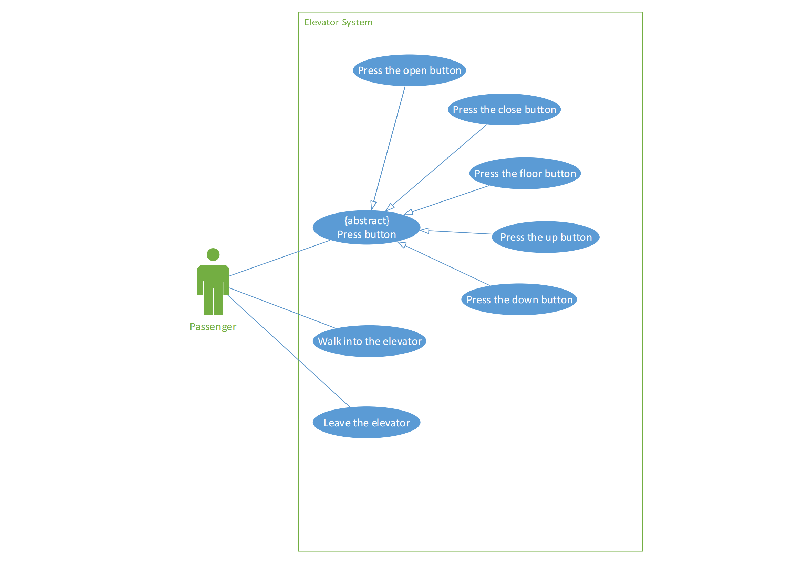
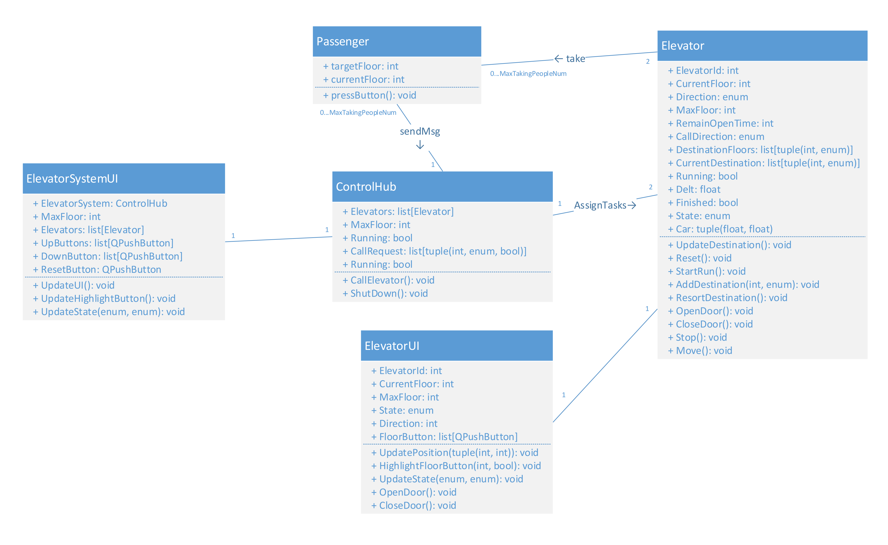
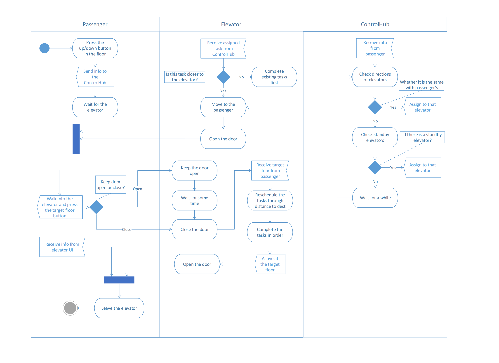

## Use case

As shown in the picture above, passengers can interact with the elevator system through these cases.

## Class

As shown in the picture above, we design 5 class for the whole elevator system. We use ElevatorSystemUI class to build a model of the building. It will show the buttons passengers can press in floor and the UI of each elevator's floor and moving direction. ElevatorUI class is used to construct the internel UI with each elevator's floor and moving direction, providing floor buttons and open/close buttons for passengers to add the dests of elevator, and to construct the car, showing where the elevator is, whether the door is openning/open/closing/closed. Also we add a reset button, aiming at easy testing.
Passengers have their current floor and dest floor, and by pressing button he can send message to the ControlHub and let ControlHub to schedule and assign tasks to different elevators.
Elevator itself maintains a list of tasks to complete. The maintenance of these two lists makes up our scheduling algorithm.

## Activity

The above picture shows a simple situation that if a passenger comes and send requests, how our elevator system will deal with it.
First passenger press the button in floor to send a call which is received by control hub, then start waiting.
Control hub restore it, and check whether there is an elevator moving in the same direction with passenger's call(This means that if passenger press up, the lower elevator which is moving up has the same direction. And vice versa.), if there exists, assign to that elevator; if not, check whether there exists a standby elevator. If yes, assign to that elevator; otherwise, wait and go back to the first check until there is an elevator match one of these two conditions.
Once elevator receives the tasks, it will resort its tasks list through distance to the destination. Those tasks closed to it will be addressed first. If arrived at passenger's floor, it stops and open the door.
Passenger walk into the elevator and assign new destination to the elevator, waiting for the door closed and the arrival.
Elevator will resort tasks again and complete them in order. After arrived at passenger's destination, the elevator open the door and the passenger leaves. The whole task completes.

## Software requirements
### System componnents
- R1.1 There should be two elevators.
- R1.2 There should be 4 floors.
- R1.3 Each elevator should have a door.
- R1.4 Each door should have four states, closed, opening, open, closing.
- R1.5 There should be two carts.
### basic features for elevator system
#### Externel call
- R2.1.1 Users can press Up/Down button in every floor except the lowest floor and highest floor. In the lowest floor, users can press Up button and in the highest floor users can press the down button.
- R2.1.2 Users can see the locations and directions of elevators in every floor.
#### Internel call
- R2.2.1 Users can press floor buttons.
- R2.2.2 Users can press the open/close buttons.
- R2.2.3 Users can see the current location and moving direction.
#### Door
- R2.3.1 Door should open automatically when the elevator arrived at the destination.
- R2.3.2 Door should close automatically after some time except for manual door operations, includes open/close in elevator and when elevator arrives at certain floor the call with same direction.
- Door state should be displayed in UI.
#### Elevator
- R2.4.1 Elevator can bring passengers to the floor they want to go to.
- R2.4.2 Elevator can move in its cart. It shouldn't be in the other cart.
- R2.4.3 Elevator can move lower than 3 floor and higher than -1 floor. It cannot move higher than 3 or lower than -1.
- R2.4.4 The movement of elevator, including locations and moving direction, should be displayed on the internel UI and externel UI.
- Elevator should be idle if it has no tasks. 
#### Addition for basic features
- R2.5.1 The current locations and moving directions for each elevator should be same in internel UI and in externel UI.
- R2.5.2 Every button pressed should have a corresponding respond.

### Schedule
#### Efficiency
- R3.1.1 During moving, elevators should only receive reachable request with same direction.
- R3.1.2 The order of tasks owned by each elevators shouldn't have inconsistent signal sources, which means there shouldn't exist one task assigned to multiple elevators.
- R3.1.3 The tasks owned by each elevators should be sorted in a reasonable order.

### Safety
- R4.1 Door should keep closed when elevator is moving.
  
### Pipeline
- R5.1 System can deal with multiple request send at same time correctly.
