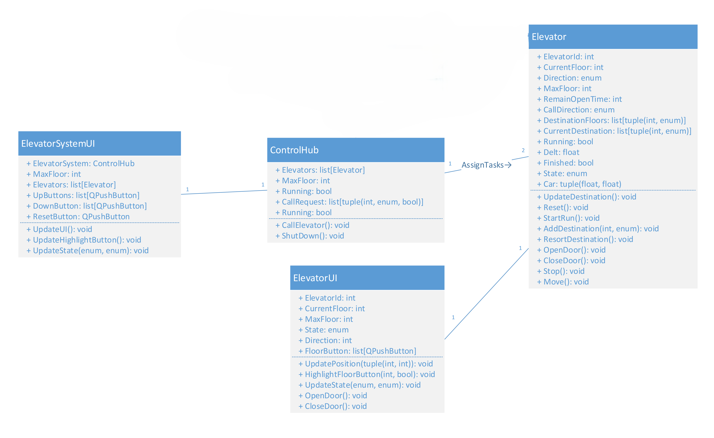
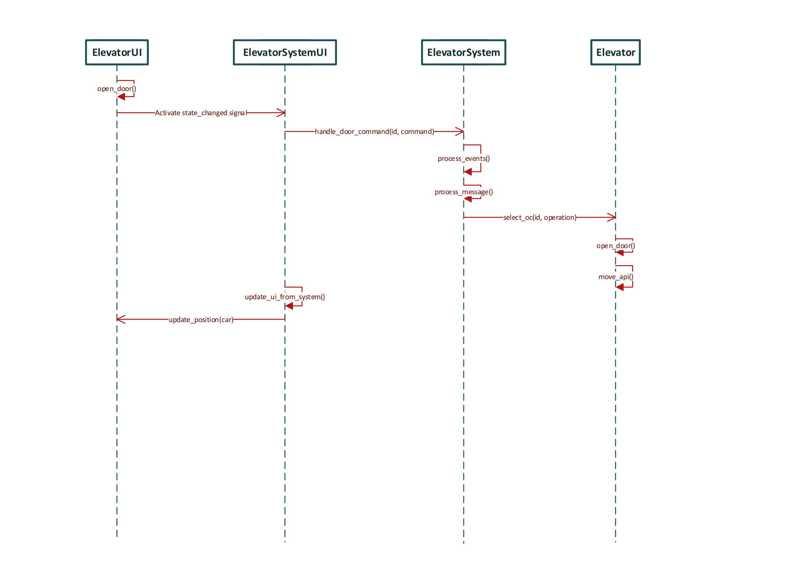
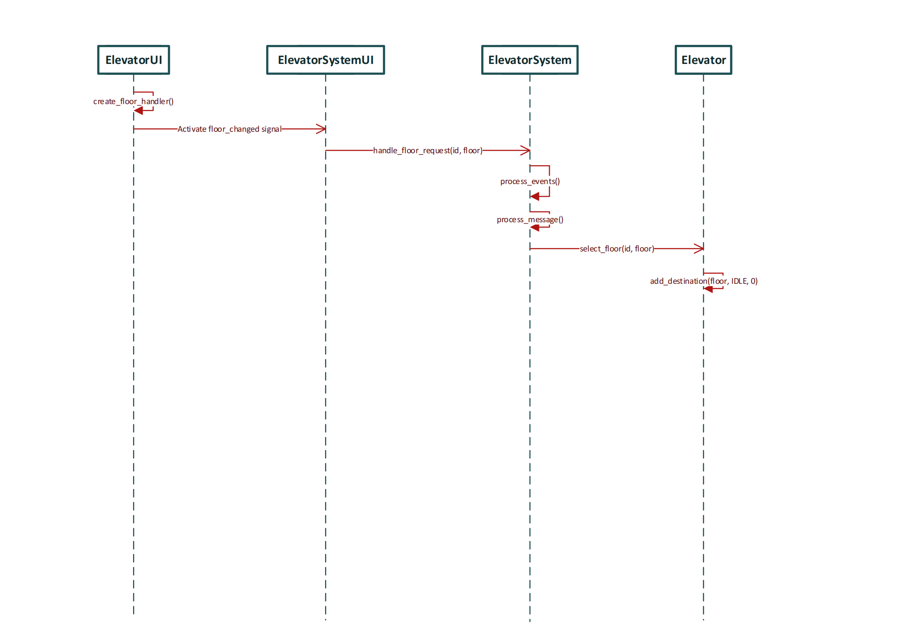
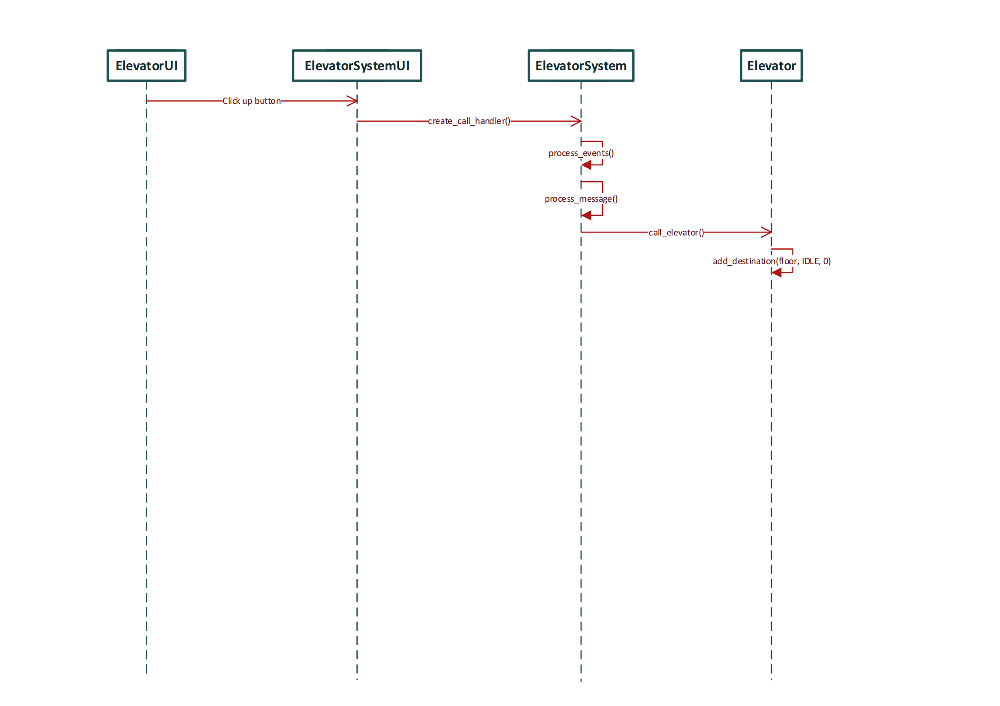
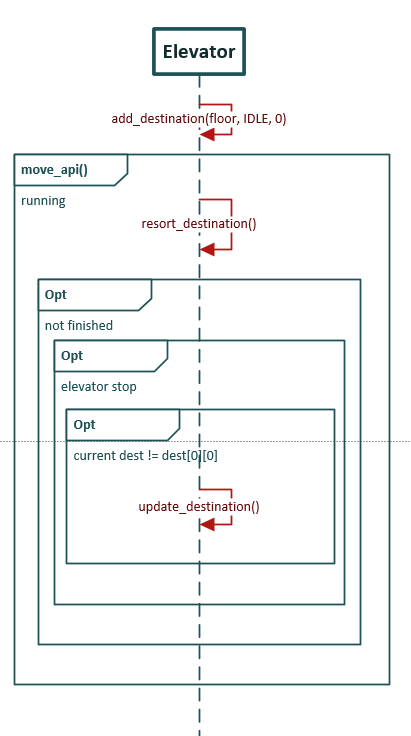
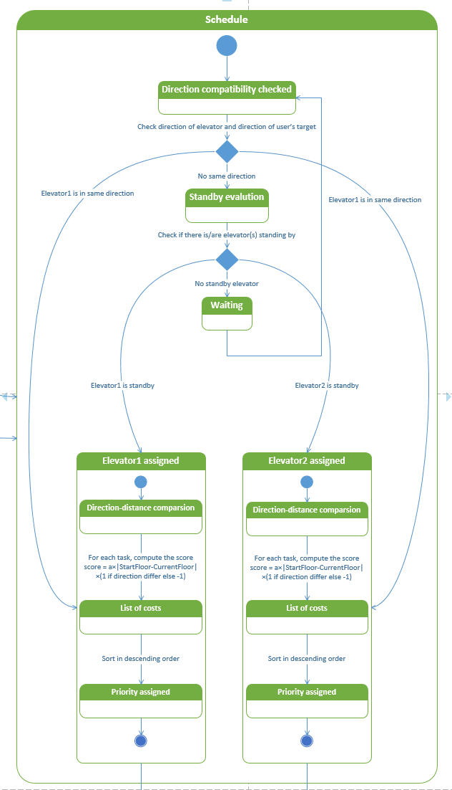
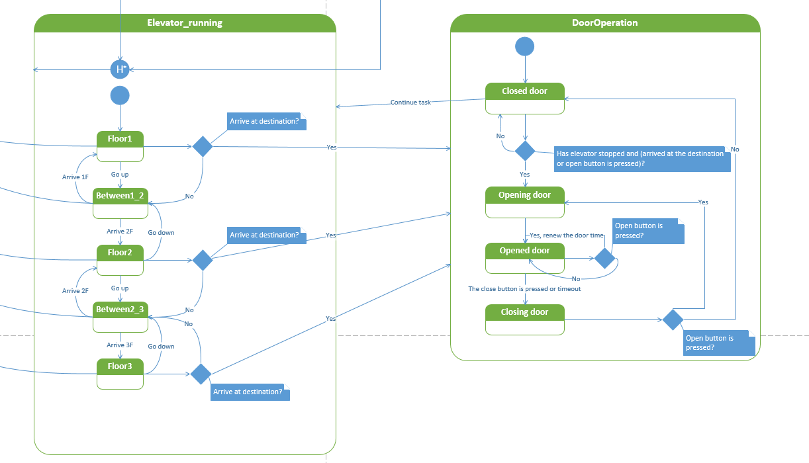
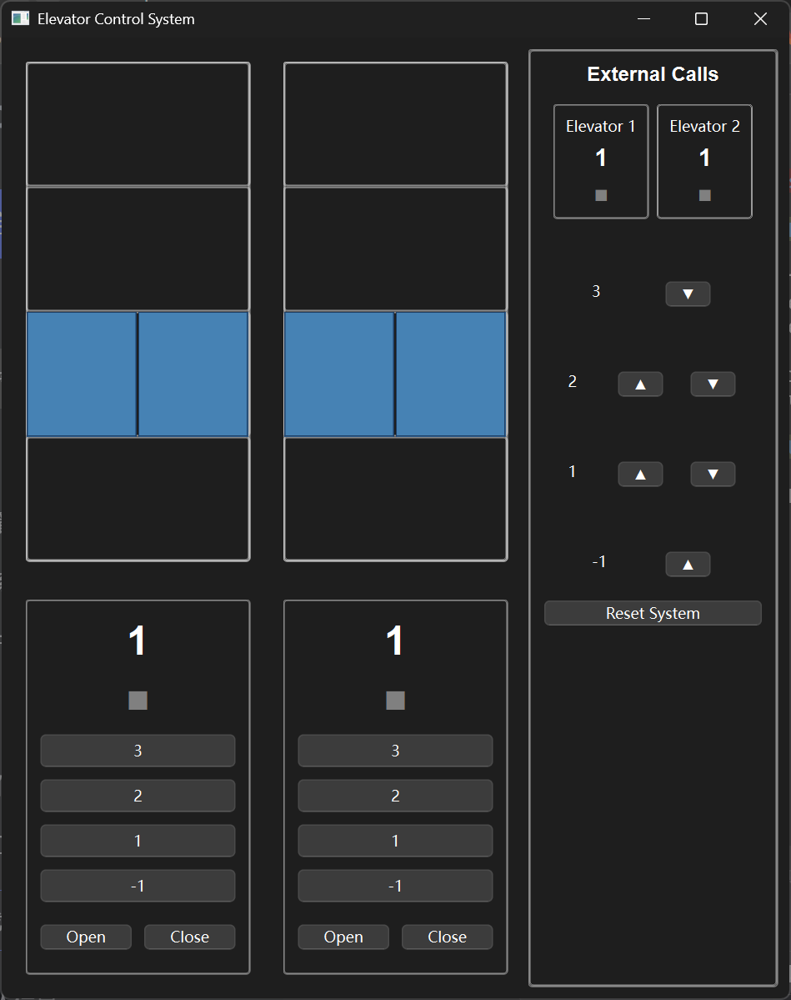

# Speceficaton

## Class diagram

## Method descriptions
### Main operations

S1.1 Open door and S1.2 Close door
Since close door is actually the same process and only modify the two open_door() funciton, I do not show two repeated images.
First, push open button. The button connects with function open_door().
open_door() will emit a signal called state_changed.
Signal state_changed is connected with function handle_door_command() in ElevatorSystemUI.
Function handle_door_command() assign a value to ElevatorSystem.zmqThread.receivedMessage, which is assigned to ElevatorSystem.serverMessage.
Function process_events() will run every 1ms, and it called function process_message().
Function process_message() called select_oc(), which finally called function open_door() in elevator and change its ElevatorState.
Elevator has an always running funciton called move_api(), which send message to the zmqThread.
Function update_ui_from_system() will run every 100ms, and it called update_position() in ElevatorUI to display the door open.

S1.3 Select floor
We can easily find that the processes of UI sending messages are almost the same.
First select the floor number in elevator and that floor button is connected to funtion create_floor_handler().
create_floor_handler() will emit a signal floor_changed.
Signal floor_changed is connected with function handle_floor_request() in ElevatorSystemUI.
Function handle_floor_request() assign a value to ElevatorSystem.zmqThread.receivedMessage, which is assigned to ElevatorSystem.serverMessage.
Function process_events() will run every 1ms, and it called function process_message().
Function process_message() called select_floor(), which finally called function add_destination() in elevator and add your destination to the list.

S1.4 Call up and S1.5 Call down
Similarly, we only represent call up since call down is the same with call up.
Click the up button will trigger ElevatorSystemUI to run the funciton create_call_handler().
This funciton assign a value to ElevatorSystem.zmqThread.receivedMessage, which is assigned to ElevatorSystem.serverMessage.
Function process_events() will run every 1ms, and it called function process_message().
Function process_message() append the call_request list, leading to the funciton call_elevator() be called.
call_elevator() will call add_destination(), and the externel schedule is finished.

### Schedule

S2.1 Schedule for internel call
As shown in the image, after function add_destination() is called, destination_floors list is not empty, then the internel schedule is working.
Funtion move_api() won't stop if the program is running. Inside its loop, it will first call function resort_destination, which strongly prioritizes current-floor stops, then requests in the current moving direction, and finally other requests by distance.
If the elevator is moving, destination won't be updated. If elevator is stopped and its current destination is different from the first one in the resorted list, update_destination() will be called.

S2.2 Schedule for externel call
This part is implemented as function call_elevator() in ElevatorSystem. This function is same as move_api(), which will always run during the system running. Ones call_request in not empty, it will start to schedule.
The overall logic of schedule is that only assign tasks to elevator which is moving in the same direction and reachable or idle. In this function, we maintain a tuple list and each tuple contains the elevator to assign and its perference score. Perference is constructed in two priorities, ride-sharing and idle. The score of ride-sharing is much smaller than idle, thus ride-sharing has a higher priority, and its elevator choice will be first chosen. If there is no ride-sharing, it checks whether there is an idle elevator and assign to it. If none of the above matches, it will not process this request and will persist until a subsequent loop.

### Safety

S3.1 Safety
As shown in the image, elevator can arrive and open door only when they are in legal states, which is four floors. Also, elevator should stop when door open. If elevator is moving, the door won't open.
During the door is open, if passengers press the open button, it will renew the door open time. If press close button or wait for a certain time, door will automatically close.

### UI

S4.1 UI show
As shown in the image, all states of elevator system will be displsyed on this UI. Since the update logic is mentioned in main operations, this part is to show the visualization of the system.
The whole UI is composed of 3 parts, car, internel ui and externel ui, which is the left-up one, left-down one and the right one. In car, elevator is shown as 2 blue blocks, which indicates the state of door. If the door is open, two blocks will move to the right side and left side separately.
In the internel ui, we have floor buttons and open/close buttons. Pressing it will trigger functions dealing with each request, and they are mentioned in S1.1 to S1.3. Above the buttons shows the location and moving direction of elevator, which will be the same with motions in car and those in ecternel ui.
In externel ui, the location and moving direction of elevator is also shown in the top. Below that is the up and down buttons in floors, and pressing them also triggers their functions, which is mentioned in S1.4 and S1.5.