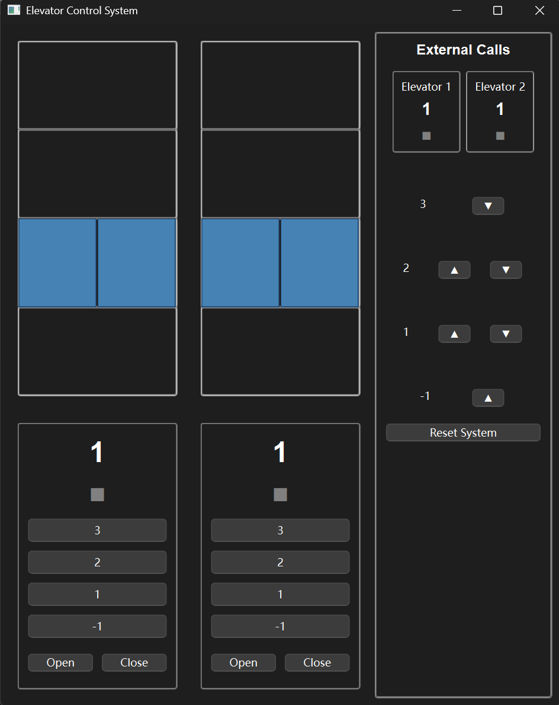
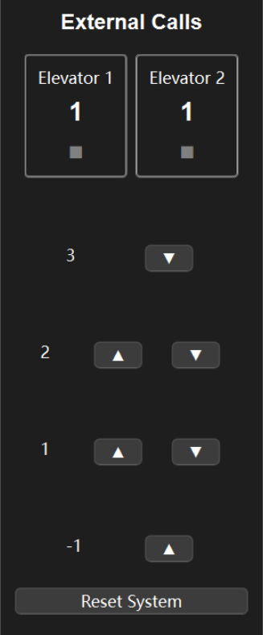
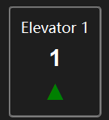
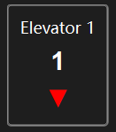
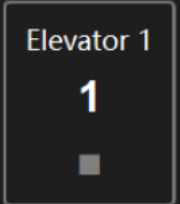
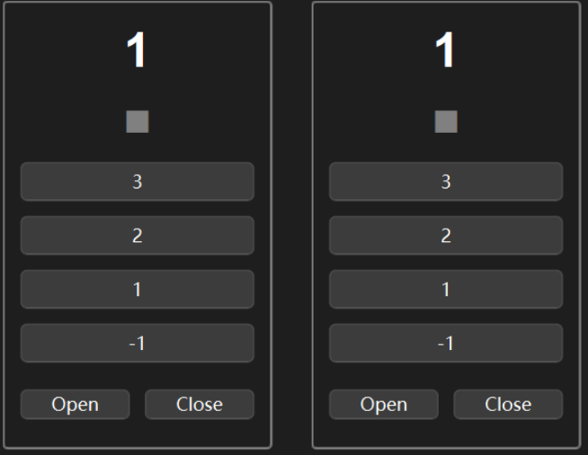
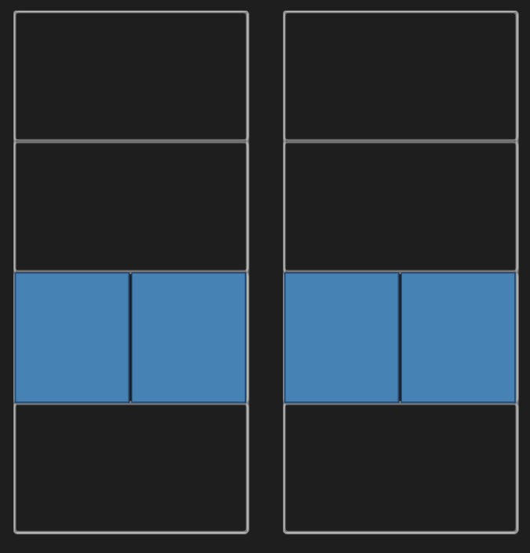

# User manual

## Environment setup

In this software, python version that support PyQt6 is needed.      
- Developiing python version: 3.12.2
- Required python version: 3.10+
- Recommanded python version: 3.12.2

To run the system, these libraries must be installed:
- PyQt6
-----------------------
## UI Introduction

1. Frist, run py ./Code/system/main.py under the whole working file and you will 
see the UI:

2. There are call buttons and reset buttons, along with the current state of each elevator displayed outside the elevator on the right:

there are 3 states for an elevator  
(1) up  

(2)down     

(3)idle     

3. there are floor buttons inside the elevator on the left:

4. We can see the elevator shaft (from up to down stand for 3F, 2F ,1F ,-1F) and the elevator car(initially at 1F):

# Workflows

1. Basic operations:
- press the call buttons will call for the elevator.
- press the "Reset System" button will reset the whole elevator system to the initial state.
- press the floor buttons will add the floor to the elevator's destination floors and be delt with by the elevaotr.
- press the open door:
  - If the elevator is moving, nothing will happen when pressing it.
  - If the elevator is oppening, it will continue opening.
  - If the elevator is opened, it will reset the remain open time.
  - If the elevator is closing or closed(not moving), it will be opening.

- press the close door will when the elevator is not moving up or down will close the door. 
  - If the elevator is moving, nothing will happen when pressing it.
  - If the elevator is oppening, it will continue opening(the close button will not do anything).
  - If the elevator is opened, it will be closing.
  - If the elevator is closing or closed(not moving) it will do nothing.

2. Cautions

On clicking, the UI need time to respond, so clicking too often on the UI may cause brief lag.
