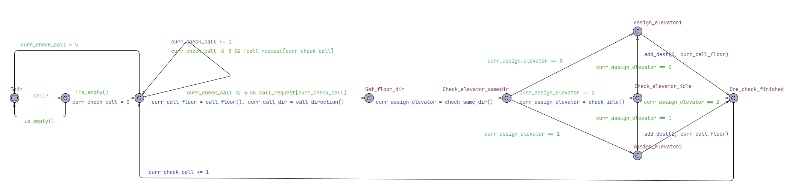
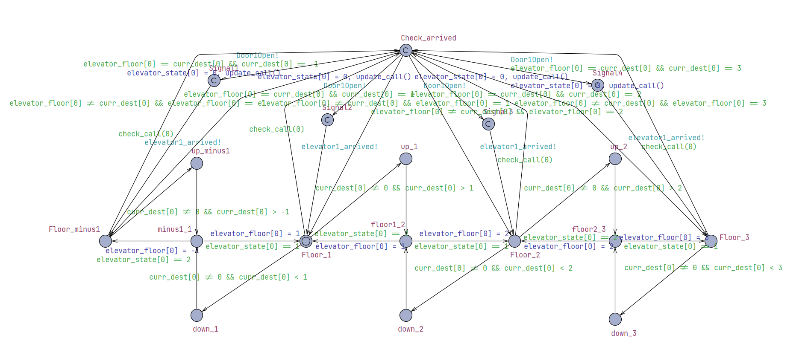
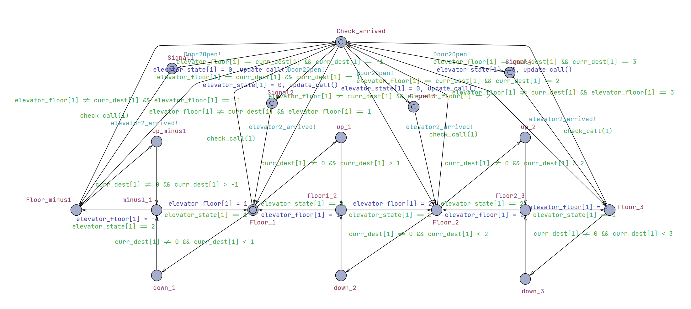
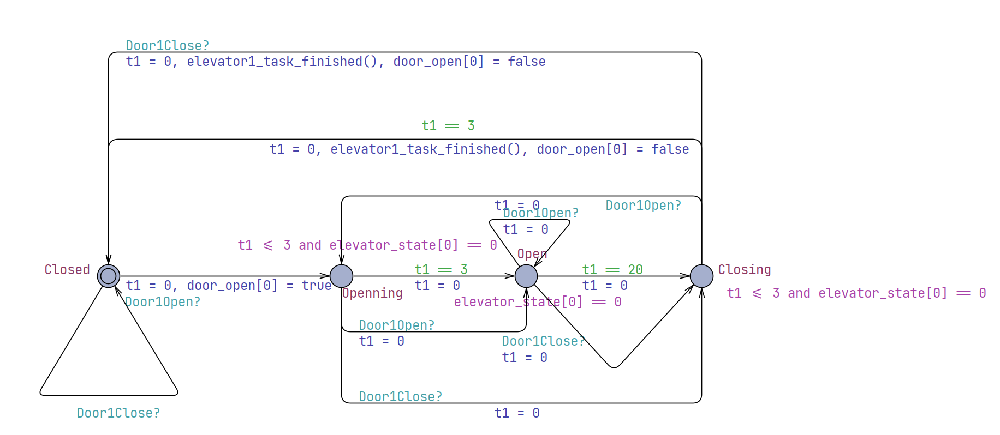
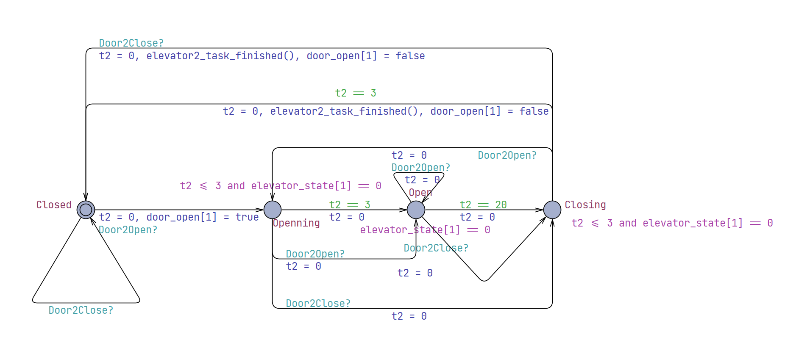
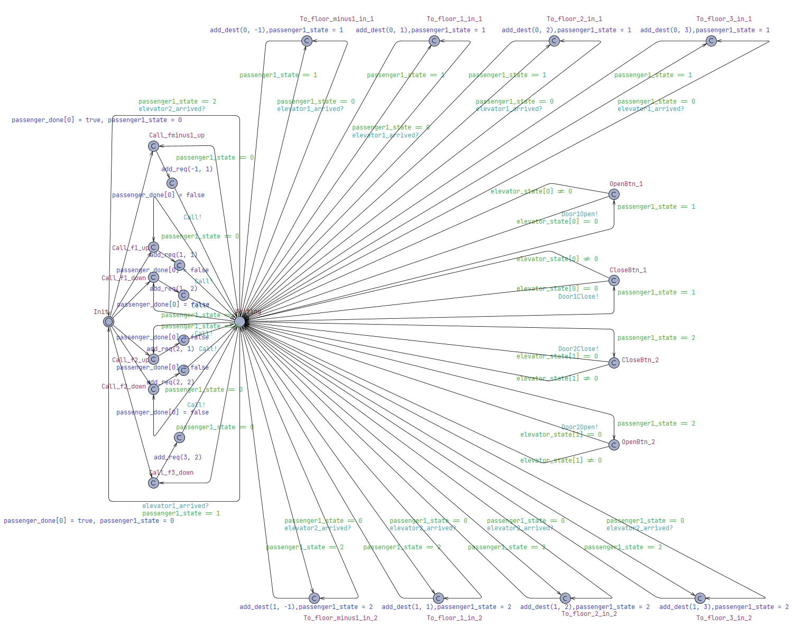
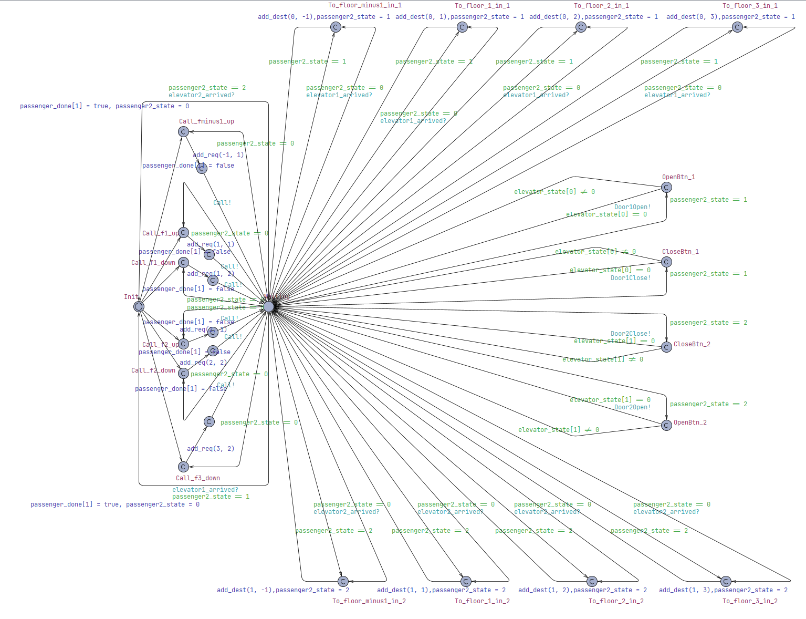
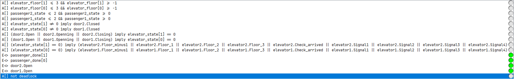

# Testing

## Unit Test

|TC|function|
|---|------|
|T1.1| test_1_1_add_destination()|
|T1.2| test_1_2_resort_destination()|
|T1.3| test_1_3_open_door()|
|T1.4| test_1_4_close_door()|
|T1.5| test_1_5_update_destination()|
|T1.6| test_1_6_move()|
|T2.1| test_2_1_elevator()|
|T2.2| test_2_2_select_floor()|
|T2.3| test_2_3_select_oc()|
|T2.4| test_2_4_process_message()|
|T3.1| test_3_1_highlight_floor_button()|
|T3.2| test_3_2_update_state()|
|T3.3| test_3_3_highlight_call_button|
|T3.4| test_3_4_update_button_highlights()|
|T3.5| test_3_5_handld_door_command()|
|T3.6| test_3_6_update_ui_from_system()|

### 1 elevator.py TC1

#### 1.1 add_destination

```python
    def add_destination(self, floor, is_external_call=Direction.IDLE, pri=0.0):
        # 1,2
        if floor == -1:
            floor = 0
        # 3,4
        existing = [f for f in self.destination_floors if f[0]
                    == floor and f[1] == is_external_call]
            # 5,6
        if not existing and (0 <= floor <= self.max_floor or floor == -1):
            self.destination_floors.append([int(floor), is_external_call, pri])
                # 7,8
            if self.currentDestination is None:
                self.currentDestination = self.destination_floors[0]
                    # 9,10
                if self.state == ElevatorState.stopped_door_closed:
                    # 11, 12
                    if self.currentDestination[0] > self.current_floor:
                        self.direction = Direction.UP
                    # 13,14
                    elif self.currentDestination[0] < self.current_floor:
                        self.state = ElevatorState.down self.direction = Direction.DOWN
            self.destination_floors.sort(key=lambda x: (x[2], x[0]))
            # 15 16
            if is_external_call != Direction.IDLE:
                self.active_requests.add((int(floor), is_external_call))
```

TC1.1.1: if floor == -1 -> True

TC1.1.2: if floor == -1 -> False

TC1.1.3: if f\[0\] == floor and f[1] == is_external_call -> True

TC1.1.4: if f\[0\] == floor and f[1] == is_external_call -> False

TC1.1.5: if not existing and (0 <= floor <= self.max_floor or floor == -1) -> True

TC1.1.6: if not existing and (0 <= floor <= self.max_floor or floor == -1) -> False

TC1.1.7: if self.currentDestination is None -> True

TC1.1.8: if self.currentDestination is None -> False

TC1.1.9: if self.state == ElevatorState.stopped_door_closed -> True

TC1.1.10: if self.state == ElevatorState.stopped_door_closed -> False

TC1.1.11: if self.currentDestination[0] > self.current_floor -> True

TC1.1.12: if self.currentDestination[0] > self.current_floor -> False

TC1.1.13: if self.currentDestination[0] < self.current_floor -> True

TC1.1.14: if self.currentDestination[0] < self.current_floor -> False

TC1.1.15: if is_external_call != Direction.IDLE -> True

TC1.1.16: if is_external_call != Direction.IDLE -> False


| TestCase | 1.1.1                                                                    | 1.1.2                                                                             | 1.1.3                                                                             | 1.1.4                                                                      |
| -------- | ------------------------------------------------------------------------ | --------------------------------------------------------------------------------- | --------------------------------------------------------------------------------- | -------------------------------------------------------------------------- |
| Input    | (-1, Direction.IDLE, 0.0)                                                | (2, Direction.UP, 1.0),(2, Direction.UP, 0.0)                                     | (2, Direction.IDLE, 0.0) (3, Direction.IDLE. 0.0)                                 | (1, Direction.UP, 0.0) (1, Direction.UP. 0.0)                              |
| TC       | TC1.1.1,TC1.1.4, TC1.1.5, TC1.1.7, TC1.1.9, TC1.1.12, TC1.1.13, TC1.1.16 | TC1.1.2, TC1.1.3,TC1.1.4, TC1.1.5, TC1.1.6, TC1.1.7, TC1.1.11, TC1.1.14, TC1.1.15 | TC1.1.2, TC1.1.3,TC1.1.4, TC1.1.5, TC1.1.6, TC1.1.7, TC1.1.11, TC1.1.14, TC1.1.15 | TC1.1.2, TC1.1.3, TC1.1.5, TC1.1.7, TC1.1.10, TC1.1.12, TC1.1.14, TC1.1.16 |
| Result   | Pass                                                                     | Pass                                                                              | Pass                                                                              | Pass                                                                       |

<!-- Test Case 1.1.1: (-1, Direction.IDLE, 0.0) : TC1.1.1,TC1.1.4, TC1.1.5, TC1.1.7, TC1.1.9, TC1.1.12, TC1.1.13, TC1.1.16 -->
<!--  -->
<!-- Test Case 1.1.2: (2, Direction.UP, 1.0),(2, Direction.UP, 0.0) : TC1.1.2, TC1.1.3,TC1.1.4, TC1.1.5, TC1.1.6, TC1.1.7, TC1.1.11, TC1.1.14, TC1.1.15 -->
<!--  -->
<!-- Test Case 1.1.3: (2, Direction.IDLE, 0.0) (3, Direction.IDLE. 0.0): TC1.1.2, TC1.1.4, TC1.1.5, TC1.1.7, TC1.1.8, TC1.1.9, TC1.1.11, TC1.1.14, TC1.1.15 -->
<!--  -->
<!-- Test Case 1.1.4: (1, Direction.UP, 0.0), (1, Direction.UP. 0.0): TC1.1.2, TC1.1.3, TC1.1.5, TC1.1.7, TC1.1.10, TC1.1.12, TC1.1.14, TC1.1.16 -->
<!--  -->

Branch Coverage: "16/16 branches covered (100%)"


#### 1.2 resort_destination()

```python
    def resort_destination(self):
        #1 2
        if self.destination_floors and self.currentDestination:
            for dest in self.destination_floors:
                # 3,4
                if self.direction == Direction.IDLE:
                    dest[2] = -5*abs(dest[0] - self.current_floor)
                else:
                # 5,6
                    dest[2] = 1 if dest[1] == Direction.IDLE else 0
                    # 7 8
                    if self.state== ElevatorState.up:
                    # 9 ,10
                        if float(dest[0]) - self.car[0] >= 0:
                            # 11 12
                            if self.currentDestination[0] == dest[0]:
                                dest[2] += -99999.0 + 10*float(float(dest[0]) - self.car[0])
                            dest[2] += -9999.0 + 10*float(float(dest[0]) - self.car[0])
                            continue
                        # 13,14
                    elif self.state == ElevatorState.down:
                        # 15,16
                        if self.car[0] - float(dest[0]) >= 0:
                            # 17,18
                            if self.currentDestination[0] == dest[0]:
                                dest[2] += -99999.0 + 10*float(float(dest[0]) - self.car[0])
                            dest[2] += -9999.0 - 10*float(float(dest[0]) - self.car[0])
                            continue
                    else:
                        # 19,20
                        if self.direction == Direction.UP:
                            # 21,22
                            if dest[0] - self.current_floor >= 0:
                            # 23 24
                                if dest[0] == self.current_floor:

                                    dest[2] += -99999.0 + 10*float(float(dest[0]) - self.car[0])
                                dest[2] += -9999 + dest[0] - self.current_floor
                                continue
                        # 25,26
                        elif self.direction == Direction.DOWN:
                            # 27,28
                            if self.current_floor - dest[0] >= 0:
                                # 29,30
                                if dest[0] == self.current_floor:
                                    dest[2] += -99999.0 + 10*float(float(dest[0]) - self.car[0])
                                dest[2] += -9999 - (dest[0] - self.current_floor)
                                continue
                    dest[2] += abs(dest[0] - self.current_floor) * 5

            self.destination_floors.sort(key=lambda x: (x[2]))
```

TC1.2.1: if self.destination_floors and self.currentDestination -> True

TC1.2.2: if self.destination_floors and self.currentDestination -> False

TC1.2.3: if self.direction == Direction.IDLE -> True

TC1.2.4: if self.direction == Direction.IDLE -> False

TC1.2.5: if dest[1] == Direction.IDLE -> True

TC1.2.6: if dest[1] == Direction.IDLE -> False

TC1.2.7: if self.state == ElevatorState.up -> True

TC1.2.8: if self.state == ElevatorState.up -> False

TC1.2.9: if float(dest[0]) - self.car[0] >= 0 -> True

TC1.2.10: if float(dest[0]) - self.car[0] >= 0 -> False

TC1.2.11: if self.currentDestination[0] == dest[0] -> True

TC1.2.12: if self.currentDestination[0] == dest[0] -> False

TC1.2.13: if self.state == ElevatorState.down -> True

TC1.2.14: if self.state == ElevatorState.down -> False

TC1.2.15: if self.car[0] - float(dest[0]) >= 0 -> True

TC1.2.16: if self.car[0] - float(dest[0]) >= 0 -> False

TC1.2.17: if self.currentDestination[0] == dest[0] -> True

TC1.2.18: if self.currentDestination[0] == dest[0] -> False

TC1.2.19: if self.direction == Direction.UP -> True

TC1.2.20: if self.direction == Direction.UP -> False

TC1.2.21: if dest[0] - self.current_floor >= 0 -> True

TC1.2.22: if dest[0] - self.current_floor >= 0 -> False

TC1.2.23: if dest[0] == self.current_floor -> True

TC1.2.24: if dest[0] == self.current_floor -> False

TC1.2.25: if self.direction == Direction.DOWN -> True

TC1.2.26: if self.direction == Direction.DOWN -> False

TC1.2.27: if self.current_floor - dest[0] >= 0 -> True

TC1.2.28: if self.current_floor - dest[0] >= 0 -> False

TC1.2.29: if dest[0] == self.current_floor -> True

TC1.2.30: if dest[0] == self.current_floor -> False

| TestCase | 1.2.1                                                                                                                                                                                                | 1.2.2                                                                                                                                                             |
| -------- | ------------------------------------------------------------------------------------------------------------------------------------------------------------------------------------------------ | ------------------------------------------------------------------------------------------------------------------------------------------------------------- |
| Input    | self.state=stopped_door_closed;<br> self.direction=Direction.IDLE; <br> self.current_floor=1;<br> self.car=[1,0]<br> destination_floors=[[2, Direction.IDLE, 0.0], <br>[3, Direction.IDLE, 0.0]] | self.state=down;<br>self.direction=DOWN;<br>self.current_floo=3;<br>self.car=[3,0]<br> destination_floors=[(2, Direction.DOWN, 0),<br> (1,Direction.IDLE, 0)] |
| TC       | TC1.2.1,TC1.2.2, TC1.2.3,TC1.2.4, TC1.2.5, TC1.2.7,TC1.2.8, TC1.2.9, TC1.2.11,TC1.2.12, TC1.2.14, TC1.2.19, TC1.2.21, TC1.2.23,TC1.2.24,TC1.2.26                                                 | TC1.2.1,TC1.2.2, TC1.2.4,TC1.2.5,TC1.2.6,TC1.2.8, TC1.2.13, TC1.2.15, TC1.2.16, TC1.2.17, TC1.2.18, TC1.2.20, TC1.2.25, TC1.2.27, TC1.2.29,TC1.2.30           |
| Result   | Pass                                                                                                                                                                                             | Pass                                                                                                                                                          |

| TestCase | 1.2.3                                                                                                                                                                                               | 1.2.4                                                                                                                                                                                                                   |
| -------- | ----------------------------------------------------------------------------------------------------------------------------------------------------------------------------------------------- | ------------------------------------------------------------------------------------------------------------------------------------------------------------------------------------------------------------------- |
| Input    | Test Case 1.2.3:<br>self.state=up;<br>self.direction=UP;<br>self.current_floor=1;<br>self.car=[1.7,0] <br>destination_floors=[(1, Direction.IDLE, 0), (2,Direction.IDLE, 0)]<br>                | <br>self.state=down;<br>self.direction=DOWN;<br>self.current_floor=3;<br>self.car=[2.7,0]<br>destination_floors=[(3, Direction.IDLE, 0), (1,Direction.IDLE, 0)]                                                     |
| TC       | TC1.2.1,TC1.2.2, TC1.2.4,TC1.2.6,TC1.2.7,TC1.2.8, TC1.2.9,TC1.2.10 TC1.2.11,TC1.2.12, TC1.2.14, TC1.2.17, TC1.2.20, TC1.2.21,TC1.2.22, TC1.2.23, TC1.2.24 TC1.2.25, TC1.2.27, TC1.2.29,TC1.2.30 | TC1.2.1,TC1.2.2, TC1.2.4,TC1.2.5,TC71.2.,TC1.2.8, TC1.2.9,TC1.2.13,TC1.2.14, TC1.2.15, TC1.2.16,TC1.2.17,TC1.2.18, TC1.2.19, TC1.2.20, TC1.2.21, TC1.2.23, TC1.2.24 TC1.2.25, TC1.2.27, TC1.2.28, TC1.2.29,TC1.2.30 |
| Result   | Pass                                                                                                                                                                                            | Pass                                                                                                                                                                                                                |

<!-- TC1,TC2, TC4,TC6,TC7,TC8, TC9,TC10 TC11,TC12, TC14, TC17, TC20, TC21,TC22, TC23, TC24 TC25, TC27, TC29,TC30 -->

<!-- Test Cases: -->
<!-- Test Case 1.2.1:   -->
<!-- self.state=stopped_door_closed;   -->
<!-- self.direction=Direction.IDLE;   -->
<!-- self.current_floor=1   -->
<!-- self.car=[1,0]   -->
<!-- [[2, Direction.IDLE, 0.0], [3, Direction.IDLE, 0.0]] : TC1.2.1,TC1.2.2, TC1.2.3,TC1.2.4, TC1.2.5, TC1.2.7,TC1.2.8, TC1.2.9, TC1.2.11,TC1.2.12, TC1.2.14, TC1.2.19, TC1.2.21, TC1.2.23,TC1.2.24,TC1.2.26 -->
<!--  -->
<!-- Test Case 1.2.2:   -->
<!-- self.state=down;   -->
<!-- self.direction=DOWN;   -->
<!-- self.current_floor=3;   -->
<!-- self.car=[3,0]   -->
<!-- destination_floors=[(2, Direction.DOWN, 0), (1,Direction.IDLE, 0)]: TC1.2.1,TC1.2.2, TC1.2.4,TC1.2.5,TC1.2.6,TC1.2.8, TC1.2.13, TC1.2.15, TC1.2.16, TC1.2.17, TC1.2.18, TC1.2.20, TC1.2.25, TC1.2.27, TC1.2.29,TC1.2.30 -->
<!--  -->
<!-- Test Case 1.2.3: -->
<!-- self.state=up; -->
<!-- self.direction=UP; -->
<!-- self.current_floor=1; -->
<!-- self.car=[1.7,0] -->
<!-- destination_floors=[(1, Direction.IDLE, 0), (2,Direction.IDLE, 0)]: TC1,TC2, TC4,TC6,TC7,TC8, TC9,TC10 TC11,TC12, TC14, TC17, TC20, TC21,TC22, TC23, TC24 TC25, TC27, TC29,TC30 -->
<!--  -->
<!-- Test Case 1.2.4:  -->
<!-- <br>self.state=down;<br>self.direction=DOWN;<br>self.current_floor=3;<br>self.car=[2.7,0]<br>destination_floors=[(3, Direction.IDLE, 0), (1,Direction.IDLE, 0)] -->
<!-- TC1.2.1,TC1.2.2, TC1.2.4,TC1.2.5,TC71.2.,TC1.2.8, TC1.2.9,TC1.2.13,TC1.2.14, TC1.2.15, TC1.2.16,TC1.2.17,TC1.2.18, TC1.2.19, TC1.2.20, TC1.2.21, TC1.2.23, TC1.2.24 TC1.2.25, TC1.2.27, TC1.2.28, TC1.2.29,TC1.2.30 -->

Branch Coverage: "29/30 branches covered (96.67%)". TC10 is not covered because the condition is never met in the current implementation.

#### 1.3 open_door()

```python
def open_door(self):
    # 1 2
    if self.state == ElevatorState.up or self.state == ElevatorState.down:
        return
    self.running = False
    # 3 4
    if self.state == ElevatorState.stopped_door_opened:
        self.remain_open_time = 3
    # 5 6
    elif self.state == ElevatorState.stopped_door_closed or self.state == ElevatorState.stopped_closing_door:
        self.state = ElevatorState.stopped_opening_door
    self.door_open = True
    # 7 8
    if self.update_callback:
        self.update_callback(self.id)
    self.running = True
    self.finished = False
```

TC1.3.1: self.state == ElevatorState.up or self.state == ElevatorState.down -> True  
TC1.3.2: self.state == ElevatorState.up or self.state == ElevatorState.down -> False  
TC1.3.3: self.state == ElevatorState.stopped_door_opened -> True  
TC1.3.4: self.state == ElevatorState.stopped_door_opened -> False  
TC1.3.5: self.state == ElevatorState.stopped_door_closed or self.state == ElevatorState.stopped_closing_door -> True  
TC1.3.6: self.state == ElevatorState.stopped_door_closed or self.state == ElevatorState.stopped_closing_door -> False  
TC1.3.7: self.update_callback -> True
TC1.3.8: self.update_callback -> False

<!-- Test Cases: -->
<!-- Test Case 1.3.1: self.state=stopped_door_opened : TC1.3.2, TC1.3.3, TC1.3.7 -->
<!-- Test Case 1.3.2: self.state=stopped_door_closed : TC1.3.2, TC1.3.4, TC1.3.5, TC1.3.7 -->
<!-- Test Case 1.3.3: self.state=up: TC1 -->
<!-- Test Case 1.3.4: self.state=stopped_opening_door: TC1.3.2, TC1.3.4, TC1.3.6, TC1.3.8 -->

| Testcase | 1.3.1                           | 1.3.2                              |
| -------- | ------------------------------- | ---------------------------------- |
| Input    | self.state =stopped_door_opened | self.state=stopped_door_opened     |
| TC       | TC1.3.2,, TC1.3.3, TC1.3.7      | TC1.3.2, TC1.3.4, TC1.3.5, TC1.3.7 |
| Result   | Pass                            | Pass                               |

| Testcase | 1.3.3          | 1.3.4                              |
| -------- | -------------- | ---------------------------------- |
| Input    | self.state =up | self.state=stopped_opening_door    |
| TC       | TC1.3.1        | TC1.3.2, TC1.3.4, TC1.3.6, TC1.3.8 |
| Result   | Pass           | Pass                               |

Branch Coverage: "8/8 branches covered (100%)"

#### 1.4 close_door

```python
    def close_door(self):
        # 1 2
        if self.state == ElevatorState.up or self.state == ElevatorState.down or
             self.state == ElevatorState.stopped_closing_door:
            return
        self.running = False
        # 3 4
        if self.state == ElevatorState.stopped_door_opened:
            self.state = ElevatorState.stopped_closing_door
        # 5 6
        elif self.state == ElevatorState.stopped_door_closed:
            self.zmqThread.sendMsg("door_closed#"+str(self.id))
        self.door_open = False
        # 7 8
        if self.update_callback:
            self.update_callback(self.id)
        self.running = True
        self.running = True
```

TC1.4.1: self.state == ElevatorState.up or self.state == ElevatorState.down or self.state == ElevatorState.stopped_closing_door -> True  
TC1.4.2: self.state == ElevatorState.up or self.state == ElevatorState.down or self.state == ElevatorState.stopped_closing_door -> False  
TC1.4.3: self.state == ElevatorState.stopped_door_opened -> True  
TC1.4.4: self.state == ElevatorState.stopped_door_opened -> False  
TC1.4.5: self.state == ElevatorState.stopped_door_closed or self.state == ElevatorState.stopped_closing_door -> True  
TC1.4.6: self.state == ElevatorState.stopped_door_closed or self.state == ElevatorState.stopped_closing_door -> False  
TC1.4.7: self.update_callback -> True  
TC1.4.8: self.update_callback -> False

<!-- Test Cases: -->
<!-- Test Case 1.4.1: self.state==stopped_door_opened : TC1.4.2, TC1.4.3, TC1.4.7 -->
<!-- Test Case 1.4.2: self.state==stopped_door_closed : TC1.4.2, TC1.4.4, TC1.4.5, TC1.4.8 -->
<!-- Test Case 1.4.3: self.state==up: TC1.4.1 -->
<!-- Test Case 1.4.4: self.state==stopped_opening_door: TC1.4.2, TC1.4.4, TC1.4.6, TC1.4.8 -->

Branch Coverage: "8/8 branches covered (100%)"
| TestCase | 1.4.1 | 1.4.2 |
|-------------------|---------------------------|--|
| Input(self.state) | stopped_door_opened | stopped_door_closed |
| TC | TC1.4.2, TC1.4.3, TC1.4.7 | TC1.4.2, TC1.4.4, TC1.4.5, TC1.4.8|
|Result|Pass|Pass|

| TestCase          | 1.4.3       | 1.4.4                                  |
| ----------------- | ------- | ---------------------------------- |
| Input(self.state) | up      | stopped_opening_door               |
| TC                | TC1.4.1 | TC1.4.2, TC1.4.4, TC1.4.6, TC1.4.8 |
| Result            | Pass    | Pass                               |

#### 1.5 update_destination()

```python
def update_destination(self):
    to_remove = set()
    for floor in self.destination_floors.copy():
        # 1 2
        if floor[0] == self.current_floor:
            # 3 4
            if (floor[1] == Direction.IDLE or (self.direction == floor[1]) and self.direction == floor[1]):
                self.destination_floors.remove(floor)
    for require in self.active_requests:
        # 5 6
        if require[0] == self.current_floor and require[1] == self.direction:
            to_remove.add(require)
    self.active_requests -= to_remove

```

TC1.5.1: if floor[0] == self.current_floor -> True  
TC1.5.2: if floor[0] == self.current_floor -> False  
TC1.5.3: if floor[1] == Direction.IDLE or (self.direction == floor[1]) and self.direction == floor[1] -> True  
TC1.5.4: if floor[1] == Direction.IDLE or (self.direction == floor[1]) and self.direction == floor[1] -> False  
TC1.5.5: if require[0] == self.current_floor and require[1] == self.direction -> True  
TC1.5.6: if require[0] == self.current_floor and require[1] == self.direction -> False

| TestCase                                                                                              | 1.5.1                                                                                                         | 1.5.2                                                                                                                            |
| ----------------------------------------------------------------------------------------------------- | --------------------------------------------------------------------------------------------------------- | ---------------------------------------------------------------------------------------------------------------------------- |
| input:<br> self.current_floor<br>self.direction<br>self.destination_floor<br><br>self.active_requests | <br>3<br>Direction.DOWN<br> [(3, Direction.DOWN, 0),<br> (2, Direction.IDLE, 0)]<br>{(3, Direction.DOWN)} | <br>3<br>Direction.DOWN<br> [(3, Direction.UP, 0),<br> (2, Direction.DOWN, 0)]<br>{(3, Direction.DOWN),<br>(2.Direction.UP)} |
| TC                                                                                                    | TC1.5.1, TC1.5.2, TC1.5.3, TC1.5.5                                                                        | TC1.5.1, TC1.5.3, TC1.5.4,TC1.5.5 TC1.5.6                                                                                    |
| Result                                                                                                | Pass                                                                                                      | Pass                                                                                                                         |

<!-- Test Cases: -->
<!-- Test Case 1.5.1: -->
<!-- self.current_floor=3 -->
<!-- self.direction = Direction.DOWN -->
<!-- self.destination_floors=[(3, Direction.DOWN, 0), (2, Direction.IDLE, 0)] -->
<!-- self.active_requests = {(3, Direction.DOWN)}: TC1.5.1, TC1.5.2, TC1.5.3, TC1.5.5 -->
<!--  -->
<!-- Test Case 1.5.2: -->
<!-- self.current_floor=2 -->
<!-- self.direction = Direction.DOWN -->
<!-- self.destination_floors=[(2, Direction.UP, 0), (2, Direction.DOWN, 0)] -->
<!-- self.active_requests = {(2, Direction.DOWN),(2,Direction.UP)}: TC1.5.1, TC1.5.3, TC1.5.4,TC1.5.5 TC1.5.6 -->

Branch Coverage: "6/6 branches covered (100%)

#### 1.6 move_api()

```python
def move_api(self):
    while self.running:
        ############ Your timed automata design ############
        # Example for the naive testcase
        self.resort_destination()
        # 1 2
        if self.current_floor == 0:
            self.direction = Direction.UP
        # 3 4
        elif self.current_floor == 3:
            self.direction = Direction.DOWN
        # 5 6
        if self.destination_floors:
            self.currentDestination = self.destination_floors[0]
            # 7 8
            if self.currentDestination[0] > self.current_floor:
                self.direction = Direction.UP
            # 9 10
            elif self.currentDestination[0] < self.current_floor:
                self.direction = Direction.DOWN
            # 11 12
            else:
                #13 14
                if self.currentDestination[1] != Direction.IDLE:
                    self.direction = self.currentDestination[1]

            self.finished = False
        else:
            self.currentDestination = None

        # 15 16
        if self.currentDestination is not None:
            # 17 18
            if self.currentDestination[1].value == 1:
                self.call_direction = Direction.UP
            # 19 20
            elif self.currentDestination[1].value == -1:
                self.call_direction = Direction.DOWN
            else:
                self.call_direction = self.direction


        # 21 22
        if self.finished:
            self.direction = Direction.IDLE
            self.call_direction = Direction.IDLE
        else:
            # print("1",self.currentDestination)
            # print("2",self.destination_floors)
            match self.state:
                # 23 24
                case ElevatorState.stopped_door_closed:
                    # 25 26
                    if self.currentDestination is not None:
                        # 27 28
                        if (self.currentDestination[0] == self.current_floor):
                            # 29 30
                            if self.current_floor != 0:
                                self.message = f"{str(self.call_direction.name).lower()}_floor_arrived@{self.current_floor}#{self.id}"
                            else:
                                self.message = f"{str(self.call_direction.name).lower()}_floor_arrived@{-1}#{self.id}"

                            self.zmqThread.sendMsg(self.message)
                            self.state = ElevatorState.stopped_opening_door
                            self.update_destination()
                            time.sleep(2)
                        # 31 32
                        elif (self.currentDestination[0] > self.current_floor):
                            self.state = ElevatorState.up
                            self.direction = Direction.UP
                        else:
                            self.state = ElevatorState.down
                            self.direction = Direction.DOWN

                # 33 34
                case ElevatorState.stopped_opening_door:
                    self.car[1] += self.delt
                    self.car[1] = round(self.car[1], 1)
                    # 35 36
                    if self.destination_floors:
                        # 37 38
                        if self.destination_floors[0][0] == self.current_floor:
                            # 39 40
                            if self.current_floor != 0:
                                self.message = f"{str(self.call_direction.name).lower()}_floor_arrived@{self.current_floor}#{self.id}"
                            else:
                                self.message = f"{str(self.call_direction.name).lower()}_floor_arrived@{-1}#{self.id}"
                            self.zmqThread.sendMsg(self.message)
                            self.update_destination()
                    # 41 42
                    if self.car[1] == 1.0:
                        self.message = f"door_opened#{self.id}"
                        self.zmqThread.sendMsg(self.message)
                        self.state = ElevatorState.stopped_door_opened
                    time.sleep(0.1)

                # 43 44
                case ElevatorState.stopped_closing_door:
                    # 45 46
                    if self.car[1] > 0:
                        self.car[1] -= self.delt
                        self.car[1] = round(self.car[1], 1)
                    #  while self.remain_open_time > 0 and self.state == ElevatorState.stopped_closing_door:
                    # 47 48
                    if self.destination_floors:
                        # 49 50
                        if self.destination_floors[0][0] == self.current_floor:
                            self.state = ElevatorState.stopped_opening_door
                            # 51 52
                            if self.current_floor != 0:
                                self.message = f"{str(self.call_direction.name).lower()}_floor_arrived@{self.current_floor}#{self.id}"
                            else:
                                self.message = f"{str(self.call_direction.name).lower()}_floor_arrived@{-1}#{self.id}"
                            self.zmqThread.sendMsg(self.message)
                            self.update_destination()
                    time.sleep(0.1)
                    # 53 54
                    if self.state != ElevatorState.stopped_closing_door:
                        self.state = ElevatorState.stopped_opening_door
                        continue
                    # 55 56
                    if self.car[1] == 0 and self.state == ElevatorState.stopped_closing_door:
                        self.state = ElevatorState.stopped_door_closed
                        self.message = f"door_closed#{self.id}"
                        self.zmqThread.sendMsg(self.message)
                        # 57 58
                        if len(self.destination_floors) == 0:
                            self.finished = True
                    #  time.sleep(0.2)


                # 59 60
                case ElevatorState.stopped_door_opened:
                    # 61 62
                    while self.remain_open_time > 0 and self.state == ElevatorState.stopped_door_opened:
                        # 63 64
                        if self.destination_floors:
                            # 65 66
                            if self.destination_floors[0][0] == self.current_floor:
                                # print(3)
                                self.state = ElevatorState.stopped_door_opened
                                self.remain_open_time=2
                                # 67 68
                                if self.current_floor != 0:
                                    self.message = f"{str(self.call_direction.name).lower()}_floor_arrived@{self.current_floor}#{self.id}"
                                else:
                                    self.message = f"{str(self.call_direction.name).lower()}_floor_arrived@{-1}#{self.id}"
                                self.zmqThread.sendMsg(self.message)
                                self.update_destination()
                                continue
                        self.remain_open_time -= 1
                        time.sleep(0.1)
                        # 69 70
                        if self.state != ElevatorState.stopped_door_opened:
                            break
                        # 71 72
                        if self.remain_open_time == 0 and self.state == ElevatorState.stopped_door_opened:
                            self.state = ElevatorState.stopped_closing_door
                            self.message = f"door_closed#{self.id}"
                            self.zmqThread.sendMsg(self.message)
                            break
                    self.remain_open_time = 2

                # 73 74
                case ElevatorState.up:
                    self.car[0] += self.delt
                    self.car[0] = round(self.car[0], 1)
                    # 75 76
                    if self.car[0] == round(int(self.car[0]), 1):
                        self.current_floor += 1
                    # 77 78
                    if self.currentDestination is not None:
                        # 79 80
                        if (float(self.currentDestination[0]) == self.car[0]):
                            self.current_floor = int(self.car[0])
                            self.state = ElevatorState.stopped_door_closed
                    time.sleep(0.2)

                # 81 82
                case ElevatorState.down:
                    self.car[0] -= self.delt
                    self.car[0] = round(self.car[0], 1)
                    # 83 84
                    if self.car[0] == round(int(self.car[0]), 1):
                        self.current_floor -= 1
                    # 85 86
                    if self.currentDestination is not None:
                        # 87 88
                        if (float(self.currentDestination[0]) == self.car[0]):
                            self.current_floor = int(self.car[0])
                            self.state = ElevatorState.stopped_door_closed
                    time.sleep(0.2)
```

TC1.6.1: self.current_floor == 0 -> True  
TC1.6.2: self.current_floor == 0 -> False  
TC1.6.3: self.current_floor == 3 -> True  
TC1.6.4: self.current_floor == 3 -> False  
TC1.6.5: self.destination_floors -> True  
TC1.6.6: self.destination_floors -> False  
TC1.6.7: self.currentDestination[0] > self.current_floor -> True  
TC1.6.8: self.currentDestination[0] > self.current_floor -> False  
TC1.6.9: self.currentDestination[0] < self.current_floor -> True  
TC1.6.10: self.currentDestination[0] < self.current_floor -> False  
TC1.6.11: self.currentDestination[1] != Direction.IDLE -> True  
TC1.6.12: self.currentDestination[1] != Direction.IDLE -> False  
TC1.6.13: self.currentDestination is not None -> True  
TC1.6.14: self.currentDestination is not None -> False  
TC1.6.15: self.currentDestination[1].value == 1 -> True  
TC1.6.16: self.currentDestination[1].value == 1 -> False  
TC1.6.17: self.currentDestination[1].value == -1 -> True  
TC1.6.18: self.currentDestination[1].value == -1 -> False  
TC1.6.19: self.finished -> True  
TC1.6.20: self.finished -> False  
TC1.6.21: self.state == ElevatorState.stopped_door_closed -> True  
TC1.6.22: self.state == ElevatorState.stopped_door_closed -> False  
TC1.6.23: self.currentDestination is not None -> True  
TC1.6.24: self.currentDestination is not None -> False  
TC1.6.25: self.currentDestination[0] == self.current_floor -> True  
TC1.6.26: self.currentDestination[0] == self.current_floor -> False  
TC1.6.27: self.current_floor != 0 -> True  
TC1.6.28: self.current_floor != 0 -> False  
TC1.6.29: self.currentDestination[0] > self.current_floor -> True  
TC1.6.30: self.currentDestination[0] > self.current_floor -> False  
TC1.6.31: self.state == ElevatorState.stopped_opening_door -> True  
TC1.6.32: self.state == ElevatorState.stopped_opening_door -> False  
TC1.6.33: self.destination_floors -> True  
TC1.6.34: self.destination_floors -> False  
TC1.6.35: self.destination_floors[0][0] == self.current_floor -> True  
TC1.6.36: self.destination_floors[0][0] == self.current_floor -> False  
TC1.6.37: self.current_floor != 0 -> True  
TC1.6.38: self.current_floor != 0 -> False  
TC1.6.39: self.car[1] == 1.0 -> True  
TC1.6.40: self.car[1] == 1.0 -> False  
TC1.6.41: self.state == ElevatorState.stopped_closing_door -> True  
TC1.6.42: self.state == ElevatorState.stopped_closing_door -> False  
TC1.6.43: self.car[1] > 0 -> True  
TC1.6.44: self.car[1] > 0 -> False  
TC1.6.45: self.destination_floors -> True  
TC1.6.46: self.destination_floors -> False  
TC1.6.47: self.destination_floors -> True  
TC1.6.48: self.destination_floors -> False  
TC1.6.49: self.destination_floors[0][0] == self.current_floor -> True  
TC1.6.50: self.destination_floors[0][0] == self.current_floor -> False  
TC1.6.51: self.current_floor != 0 -> True  
TC1.6.52: self.current_floor != 0 -> False  
TC1.6.53: self.state != ElevatorState.stopped_closing_door -> True  
TC1.6.54: self.state != ElevatorState.stopped_closing_door -> False  
TC1.6.55: self.car[1] == 0 and self.state == ElevatorState.stopped_closing_door -> True  
TC1.6.56: self.car[1] == 0 and self.state == ElevatorState.stopped_closing_door -> False  
TC1.6.57: len(self.destination_floors) == 0 -> True  
TC1.6.58: len(self.destination_floors) == 0 -> False  
TC1.6.59: self.state == ElevatorState.stopped_door_opened -> True  
TC1.6.60: self.state == ElevatorState.stopped_door_opened -> False  
TC1.6.61: self.remain_open_time > 0 and self.state == ElevatorState.stopped_door_opened -> True  
TC1.6.62: self.remain_open_time > 0 and self.state == ElevatorState.stopped_door_opened -> False  
TC1.6.63: self.destination_floors -> True  
TC1.6.64: self.destination_floors -> False  
TC1.6.65: self.destination_floors[0][0] == self.current_floor -> True  
TC1.6.66: self.destination_floors[0][0] == self.current_floor -> False  
TC1.6.67: self.current_floor != 0 -> True  
TC1.6.68: self.current_floor != 0 -> False  
TC1.6.69: self.state != ElevatorState.stopped_door_opened -> True  
TC1.6.70: self.state != ElevatorState.stopped_door_opened -> False  
TC1.6.71: self.remain_open_time == 0 and self.state == ElevatorState.stopped_door_opened -> True  
TC1.6.72: self.remain_open_time == 0 and self.state == ElevatorState.stopped_door_opened -> False  
TC1.6.73: self.state == ElevatorState.up -> True  
TC1.6.74: self.state == ElevatorState.up -> False  
TC1.6.75: self.car[0] == round(int(self.car[0]), 1) -> True  
TC1.6.76: self.car[0] == round(int(self.car[0]), 1) -> False  
TC1.6.77: self.currentDestination is not None -> True  
TC1.6.78: self.currentDestination is not None -> False  
TC1.6.79: (float(self.currentDestination[0]) == self.car[0]) -> True  
TC1.6.80: (float(self.currentDestination[0]) == self.car[0]) -> False  
TC1.6.81: self.state == ElevatorState.down -> True  
TC1.6.82: self.state == ElevatorState.down -> False  
TC1.6.83: self.car[0] == round(int(self.car[0]), 1) -> True  
TC1.6.84: self.car[0] == round(int(self.car[0]), 1) -> False  
TC1.6.85: self.currentDestination is not None -> True  
TC1.6.86: self.currentDestination is not None -> False  
TC1.6.87: (float(self.currentDestination[0]) == self.car[0]) -> True  
TC1.6.88: (float(self.currentDestination[0]) == self.car[0]) -> True

| Testcase                                                                                    | 1.6.1                                                                                                                   | 1.6.2                                                                  | 1.6.3                                                                                               |
| ------------------------------------------------------------------------------------------- | ------------------------------------------------------------------------------------------------------------------- | ------------------------------------------------------------------ | ----------------------------------------------------------------------------------------------- |
| self.current_floor<br>self.destinatoin_floor<br><br>self.state<br>self.car<br>self.finished | 1<br>[ ]<br><br>stopped_door_closed<br>[1.0,0,0]<br>False                                                           | 0<br>[ ]<br><br>stopped_door_closed<br>[1.0,0,0]<br>False          | 3<br>[(2,Direction.DOWN,0)<br>(1,Direction.UP,0) ]<br>stopped_door_closed<br>[1.0,0,0]<br>False |
| TC                                                                                          | TC1.6.2, TC1.6.4, TC1.6.6, TC1.6.14, TC1.6.20, TC1.6.22, TC1.6.24, TC1.6.32, TC1.6.42, TC1.6.60, TC1.6.74, TC1.6.82 | TC1.6.1, TC1.6.5, TC1.6.13, TC1.6.19, TC1.6.21, TC1.6.25, TC1.6.28 | TC1.6.3, TC1.6.7, TC1.6.9, TC1.6.11, TC1.6.15, TC1.6.17, TC1.6.23, TC1.6.26, TC1.6.27, TC1.6.29 |
| Result                                                                                      | Pass                                                                                                                | Pass                                                               | Pass                                                                                            |

| Testcase                                                                                    | 1.6.4                                                                             | 1.6.5                                                                     | 1.6.6                                                                                           |
| ------------------------------------------------------------------------------------------- | ----------------------------------------------------------------------------- | --------------------------------------------------------------------- | ------------------------------------------------------------------------------------------- |
| self.current_floor<br>self.destinatoin_floor<br><br>self.state<br>self.car<br>self.finished | 1<br>[(1.5,Direction.IDLE,9)]<br><br>up<br>[1.49,0.0]<br>\                    | 2<br>[(2.Dire.UP,0) ]<br><br>stopped_opening_door<br>[2.0,0,9]<br> \  | 1<br>[(2,Direction.DOWN,0),(1,Direction.UP,0) ]<br>stopped_closing_door<br>[1.0,0.1]<br> \  |
| TC                                                                                          | TC1.6.8, TC1.6.10, TC1.6.12, TC1.6.16, TC1.6.18, TC1.6.30, TC1.6.75, TC1.6.79 | TC1.6.31, TC1.6.33, TC1.6.35, TC1.6.37, TC1.6.39, TC1.6.40, TC1.6.43  | TC1.6.41, TC1.6.44, TC1.6.45, TC1.6.49, TC1.6.51, TC1.6.53, TC1.6.55, TC1.6.57              |
| Result                                                                                      | Pass                                                                          | Pass                                                                  | Pass                                                                                        |

| Testcase                                                                                | 1.6.7                                                                    | 1.6.8                                                                     | 1.6.9                                                   |
| --------------------------------------------------------------------------------------- | -------------------------------------------------------------------- | --------------------------------------------------------------------- | --------------------------------------------------- |
| self.current_floor<br>self.destinatoin_floor<br>self.state<br>self.car<br>self.finished | 2<br>[]<br>stopped_closing_door<br>[2.0,0,0]<br>\                    | 3<br>[(3,Direction.UP,0)]<br>stopped_door_opend<br>[1.0,0,0]<br>False | 1<br>(1,Direction.UP,0) ]<br>up<br>[1.1,0,0]<br> \  |
| TC                                                                                      | TC1.6.46, TC1.6.48, TC1.6.50, TC1.6.52, TC1.6.54, TC1.6.56, TC1.6.58 | TC1.6.59, TC1.6.61, TC1.6.63, TC1.6.65, TC1.6.67, TC1.6.69, TC1.6.71  | TC1.6.73, TC1.6.76, TC1.6.77, TC1.6.80              |
| Result                                                                                  | Pass                                                                 | Pass                                                                  | Pass                                                |

| Testcase                                                                                | 1.6.10                                                | 1.6.11                                                                                                 | 1.6.12                                                       |
| --------------------------------------------------------------------------------------- | ------------------------------------------------- | -------------------------------------------------------------------------------------------------- | -------------------------------------------------------- |
| self.current_floor<br>self.destinatoin_floor<br>self.state<br>self.car<br>self.finished | 2<br>[]<br>stopped_door_opened<br>[1.3,0,0]<br>\  | 0<br>[]<br>stopped_door_opend<br>[0,1]<br>True                                                     | 1<br>[(1,Direction.IDLE,0) ]<br>down<br>[1.3,0,0]<br> \  |
| TC                                                                                      | TC1.6.81, TC1.6.83, TC1.6.85, TC1.6.87            | TC1.6.34, TC1.6.36, TC1.6.38, TC1.6.47, TC1.6.62, TC1.6.64, TC1.6.66, TC1.6.68, TC1.6.70, TC1.6.72 | TC1.6.78, TC1.6.84, TC1.6.86, TC1.6.88                   |
| Result                                                                                  | Pass                                              | Pass                                                                                               | Pass                                                     |

<!-- Test Case 1.6.10: 下降运动+精确停止 -->
<!-- : TC1.6.81, TC1.6.83, TC1.6.85, TC1.6.87 -->
<!-- self.current_floor = 2 -->
<!-- self.destination_floors = [(1, Direction.DOWN, 0)] -->
<!-- self.state = ElevatorState.down -->
<!-- self.car = [1.1, 0.0] -->
<!--  -->
<!-- Test Case 1.6.11: 空闲状态完成 -->
<!-- : TC1.6.34, TC1.6.36, TC1.6.38, TC1.6.47, TC1.6.62, TC1.6.64, TC1.6.66, TC1.6.68, TC1.6.70, TC1.6.72 -->
<!-- self.current_floor = 0 -->
<!-- self.destination_floors = [] -->
<!-- self.state = ElevatorState.stopped_door_opened -->
<!-- self.car = [0,1] -->
<!-- self.finished = True -->
<!--  -->
<!-- Test Case 1.6.12: 楼层精确匹配检测 -->
<!-- : TC1.6.78, TC1.6.84, TC1.6.86, TC1.6.88 -->
<!-- self.current_floor = 1 -->
<!-- self.destination_floors = [(1, Direction.IDLE, 0)] -->
<!-- self.state = ElevatorState.down -->
<!-- self.car = [1.3, 0.0] -->
<!--  -->
<!-- Test Case 1.6.1: 初始状态无目标楼层 (覆盖基础分支) -->
<!-- : TC1.6.2, TC1.6.4, TC1.6.6, TC1.6.14, TC1.6.20, TC1.6.22, TC1.6.24, TC1.6.32, TC1.6.42, TC1.6.60, TC1.6.74, TC1.6.82 -->
<!-- self.current_floor = 1 -->
<!-- self.destination_floors = [] -->
<!-- self.state = ElevatorState.stopped_door_closed -->
<!-- self.car = [1.0, 0.0] -->
<!-- self.finished = False -->
<!--  -->
<!-- Test Case 1.6.2: 地下层特殊处理 (覆盖-1 逻辑) -->
<!-- : TC1.6.1, TC1.6.5, TC1.6.13, TC1.6.19, TC1.6.21, TC1.6.25, TC1.6.28 -->
<!-- self.current_floor = 0 # 假设 0 表示地下层 -->
<!-- self.destination_floors = [(-1, Direction.UP, 0)] -->
<!-- self.state = ElevatorState.stopped_door_closed -->
<!--  -->
<!-- Test Case 1.6.3: 顶层特殊处理+方向转换 -->
<!-- : TC1.6.3, TC1.6.7, TC1.6.9, TC1.6.11, TC1.6.15, TC1.6.17, TC1.6.23, TC1.6.26, TC1.6.27, TC1.6.29 -->
<!-- self.current_floor = 3 -->
<!-- self.destination_floors = [(2, Direction.DOWN, 0), (1, Direction.UP, 0)] -->
<!-- self.state = ElevatorState.stopped_door_closed -->
<!--  -->
<!-- Test Case 1.6.4: 精确楼层到达检测 -->
<!-- : TC1.6.8, TC1.6.10, TC1.6.12, TC1.6.16, TC1.6.18, TC1.6.30, TC1.6.75, TC1.6.79 -->
<!-- self.current_floor = 1 -->
<!-- self.destination_floors = [(1.5, Direction.IDLE, 0)] -->
<!-- self.state = ElevatorState.up -->
<!-- self.car = [1.49, 0.0] # 即将到达 -->
<!--  -->
<!-- Test Case 1.6.5: 开门过程+新请求插入 -->
<!-- : TC1.6.31, TC1.6.33, TC1.6.35, TC1.6.37, TC1.6.39, TC1.6.40, TC1.6.43 -->
<!-- self.current_floor = 2 -->
<!-- self.destination_floors = [(2, Direction.UP, 0)] -->
<!-- self.state = ElevatorState.stopped_opening_door -->
<!-- self.car = [2.0, 0.9] -->
<!--  -->
<!-- Test Case 1.6.6: 关门中断(新请求) -->
<!-- : TC1.6.41, TC1.6.44, TC1.6.45, TC1.6.49, TC1.6.51, TC1.6.53, TC1.6.55, TC1.6.57 -->
<!-- self.current_floor = 1 -->
<!-- self.destination_floors = [(1, Direction.DOWN, 0)] -->
<!-- self.state = ElevatorState.stopped_closing_door -->
<!-- self.car = [1.0, 0.1] -->
<!--  -->
<!-- Test Case 1.6.7: 完全关门 -->
<!-- : TC1.6.46, TC1.6.48, TC1.6.50, TC1.6.52, TC1.6.54, TC1.6.56, TC1.6.58 -->
<!-- self.current_floor = 2 -->
<!-- self.destination_floors = [] -->
<!-- self.state = ElevatorState.stopped_closing_door -->
<!-- self.car = [2.0, 0.0] -->
<!--  -->
<!-- Test Case 1.6.8: 门全开状态 -->
<!-- : TC1.6.59, TC1.6.61, TC1.6.63, TC1.6.65, TC1.6.67, TC1.6.69, TC1.6.71 -->
<!-- self.current_floor = 3 -->
<!-- self.destination_floors = [(3, Direction.DOWN, 0)] -->
<!-- self.state = ElevatorState.stopped_door_opened -->
<!-- self.remain_open_time = 1.6 -->
<!--  -->
<!-- Test Case 1.6.9: 上升运动+楼层计数 -->
<!-- : TC1.6.73, TC1.6.76, TC1.6.77, TC1.6.80 -->
<!-- self.current_floor = 1 -->
<!-- self.destination_floors = [(2, Direction.UP, 0)] -->
<!-- self.state = ElevatorState.up -->
<!-- self.car = [1.1, 0.0] -->
<!--  -->

Test Coverage: "88/88 branches covered (100%)"

### 2 ElevatorSystem

#### 2.1 call_elevator

```python
def call_elevator(self):
    while True:
        # 1 2
        self.call_requests = [list(i) for i in self.call_requests if i[2] == True]
        call_requests = [list(i) for i in self.call_requests if i[2] == True]

        # 3 4
        if call_requests is None:
            return
        for call_request in call_requests:
            floor, is_external_call, _ = call_request
            for elevator in self.elevators:
                for dest in elevator.destination_floors:
                    # 5 6
                    if dest[0] == floor and dest[1] == is_external_call:
                        call_request[2] = False
                        continue
            # 7 8
            if call_request[2] == False:
                break

            elevator_choice = []
            for elevator in self.elevators:
                # 可以搭顺风车：最优

                # 9 10
                if elevator.state == ElevatorState.up and (floor - elevator.current_floor >= 2 or elevator.current_floor == 3 and floor == 3):
                        # print(1)
                        total_score =-9999 + floor - elevator.current_floor
                        elevator_choice.append((elevator.id, total_score))
                        continue
                # 11 12
                if elevator.state == ElevatorState.down and elevator.current_floor - floor >= 2:
                        # print(2)
                        total_score =-9999 - (floor - elevator.current_floor)
                        elevator_choice.append((elevator.id, total_score))
                        continue
                # if elevator.state == ElevatorState.stopped_door_opened or elevator.state == ElevatorState.stopped_opening_door:

                # 13 14
                if elevator.direction == Direction.UP and is_external_call == Direction.UP and if elevator.state != ElevatorState.up and (floor - elevator.current_floor >= 0):
                            total_score =-9999 + floor - elevator.current_floor
                            elevator_choice.append((elevator.id, total_score))
                            continue
                # 15 16
                if elevator.direction == Direction.DOWN and is_external_call == Direction.DOWN and elevator.state != ElevatorState.down and elevator.current_floor - floor >= 0:

                            total_score =-9999 - (floor - elevator.current_floor)
                            elevator_choice.append((elevator.id, total_score))
                            continue

                # 电梯空闲：次优
                total_score = 0
                # 17 18
                if elevator.finished:
                    # print(123)
                    # print(call_request)
                    # print(call_requests)
                    total_score = -999
                    total_score += abs(elevator.current_floor - floor) * 5
                    elevator_choice.append((elevator.id, total_score))
                    # call_request[2] = False
                    continue
            # 19 20
            if elevator_choice:
                elevator = min(elevator_choice, key=lambda x:x[1])
                self.elevators[elevator[0]-1].add_destination(floor,is_external_call,0)
                # 21 22
                if call_request[0] == floor and call_request[1] == is_external_call:
                    to_remove = set()
                    for f, is_t_c in self.active_requests:
                        # 23 24
                        if f==floor and is_t_c==is_external_call:
                            to_remove = set()
                            to_remove.add((f,is_t_c))
                    self.active_requests -= to_remove
                # call_request[2] = False
                for calreq in self.call_requests:
                    # 25 26
                    if calreq == call_request:
                        calreq[2] = False
            else:
                self.active_requests.add((floor, is_external_call))
            time.sleep(1)
```

TC2.1.1: i[2] == True -> True  
TC2.1.1: i[2] == True ->False  
TC2.1.3: call_requests is None -> True  
TC2.1.3: call_requests is None -> False  
TC2.1.5: dest[0] == floor and dest[1] == is_external_call -> True  
TC2.1.6: dest[0] == floor and dest[1] == is_external_call -> False  
TC2.1.7: call_request[2] == False -> True  
TC2.1.8: call_request[2] == False -> False  
TC2.1.9: elevator.state == ElevatorState.up and (floor - elevator.current_floor >= 2 or elevator.current_floor == 3 and floor == 3) -> True  
TC2.1.10: elevator.state == ElevatorState.up and (floor - elevator.current_floor >= 2 or elevator.current_floor == 3 and floor == 3) -> False  
TC2.1.11: elevator.state == ElevatorState.down and elevator.current_floor - floor >= 2 -> True  
TC2.1.12: elevator.state == ElevatorState.down and elevator.current_floor - floor >= 2 -> False  
TC2.1.13: elevator.direction == Direction.UP and is_external_call == Direction.UP and if elevator.state != ElevatorState.up and (floor - elevator.current_floor >= 0) -> True  
TC2.1.14: elevator.direction == Direction.UP and is_external_call == Direction.UP and if elevator.state != ElevatorState.up and (floor - elevator.current_floor >= 0) -> False  
TC2.1.15: elevator.direction == Direction.DOWN and is_external_call == Direction.DOWN and elevator.state != ElevatorState.down and elevator.current_floor - floor >= 0 -> True  
TC2.1.16: elevator.direction == Direction.DOWN and is_external_call == Direction.DOWN and elevator.state != ElevatorState.down and elevator.current_floor - floor >= 0 -> False  
TC2.1.17: elevator.finished -> True  
TC2.1.18: elevator.finished -> False  
TC2.1.19: elevator_choice -> True  
TC2.1.20: elevator_choice -> False  
TC2.1.21: call_request[0] == floor and call_request[1] == is_external_call -> True  
TC2.1.22: call_request[0] == floor and call_request[1] == is_external_call -> False  
TC2.1.23: f==floor and is_t_c==is_external_call -> True  
TC2.1.24: f==floor and is_t_c==is_external_call -> False  
TC2.1.25: calreq == call_request -> True  
TC2.1.26: calreq == call_request -> False

| Testcase                                                               | 2.1.1                                                                                                                                                                                                                           | 2.1.2                      |
| ---------------------------------------------------------------------- | --------------------------------------------------------------------------------------------------------------------------------------------------------------------------------------------------------------------------- | ---------------------- |
| self.call_requests<br><br>self.elevators.current_floors<br>self.states | [(1,Direction.UP, True),(2, Direction.UP, True)<br> (1, Direction.DOWN, True), (1, Direction.DOWN, True)]<br> [-1, 3]<br> [up, down]                                                                                        | None<br><br> \ <br> \  |
| TC                                                                     | TC2.1.1, TC2.1.2, TC2.1.4, TC2.1.5, TC2.1.6, TC2.1.7,TC2.1.8, TC2.1.9, TC2.1.10, TC2.1.11, TC2.1.12, TC2.1.14, TC2.1.16, TC2.1.17, TC2.1.18, TC2.1.19, TC2.1.20, TC2.1.21, TC2.1.22, TC2.1.23, TC2.1.24, TC2.1.25, TC2.1.26 | TC2.1.3                |
| Result                                                                 | Pass                                                                                                                                                                                                                        | Pass                   |

| Testcase                                                                                          | 2.1.3                           | 2.1.4                                                                                                                                                    |
| ------------------------------------------------------------------------------------------------- | --------------------------- | ---------------------------------------------------------------------------------------------------------------------------------------------------- |
| self.call_requests<br>self.elevators.current_floors<br>self.states <br> self.elevators.directions | None <br><br> \ <br> \ <br> | [(2,Direction.UP, True),(2, Direction.DOWN, True)] <br> [1, 3] <br> [stopped_closing_door, stopped_closing_door] <br> [Direction.UP, Direction.DOWN] |
| TC                                                                                                | TC2.1.3                     | TC2.1.1, TC1.2.1, TC2.1.4, TC2.1.6, ,TC2.1.8, TC2.1.10, TC2.1.12, TC2.1.13, TC2.1.14, TC2.1.15, TC2.1.16, TC2.1.18, TC2.1.19, TC2.1.21, TC2.1.25     |
| Result                                                                                            | Pass                        | Pass                                                                                                                                                 |

<!-- Test Cases: -->
<!-- Test Case 2.1.1: -->
<!-- self.call_requests = [(1,Direction.UP, True),(2, Direction.UP, True), (1, Direction.DOWN, True), (1, Direction.DOWN, True)], -->
<!-- self.elevators.current_floors = [-1, 3] -->
<!-- self.elevators.states = [up, down] -->
<!-- :TC2.1.1, TC2.1.2, TC2.1.4, TC2.1.5, TC2.1.6, TC2.1.7,TC2.1.8, TC2.1.9, TC2.1.10, TC2.1.11, TC2.1.12, TC2.1.14, TC2.1.16, TC2.1.17, TC2.1.18, TC2.1.19, TC2.1.20, TC2.1.21, TC2.1.22, TC2.1.23, TC2.1.24, TC2.1.25, TC2.1.26 -->
<!--  -->
<!-- Test Case 2.1.2: -->
<!-- self.call_requests = None -->
<!--  -->
<!-- : TC2.1.3 -->
<!--  -->
<!-- Test Case 2.1.3: -->
<!-- self.call_requests = [(2,Direction.UP, True),(2, Direction.DOWN, True)], -->
<!-- self.elevators.current_floors = [1, 3] -->
<!-- self.elevators.states = [stopped_closing_door, stopped_closing_door] -->
<!-- self.elevators.directions = [Direction.UP, Direction.DOWN] -->
<!-- : TC2.1.1, TC1.2.1, TC2.1.4, TC2.1.6, ,TC2.1.8, TC2.1.10, TC2.1.12, TC2.1.13, TC2.1.14, TC2.1.15, TC2.1.16, TC2.1.18, TC2.1.19, TC2.1.21, TC2.1.25 -->

Branch Coverage: "26/26 branches covered (100%)"

#### 2.2 select_floor

```python


def select_floor(self, elevator_id, floor):
    # 1 2
    if 1 <= elevator_id <= len(self.elevators) and (1 <= floor <= self.max_floor  or floor == -1):
        self.elevators[elevator_id-1].add_destination(floor, Direction.IDLE,0)
        time.sleep(1)

```

TC2.2.1: 1 <= elevator_id <= len(self.elevators) -> True  
TC2.2.2: 1 <= elevator_id <= len(self.elevators) -> False

| Testcase               | 2.2.1   | 2.2.2   |
| ---------------------- | ------- | ------- |
| elevator_id <br> floor | 1<br> 2 | 1<br> 5 |
| TC                     | TC2.2.1 | TC2.2.2 |
| Result                 | Pass    | Pass    |

<!-- Test Case 2.2.1: -->
<!-- elevator_id=1, floor=2 : TC2.2.1 -->
<!-- Test Case 2.2.2: -->
<!-- elevator_id=1, floor=5 : TC2.2.2 -->

Branch Coverage: "2/2 branches covered (100%)"

#### 2.3 select_oc

```python
def select_oc(self, elevator_id, op):
    # 1 2
    if not (1 <= elevator_id <= len(self.elevators)):
        print("Invalid elevator ID!")
        return
    elevator = self.elevators[elevator_id-1]
    # 3 4
    if op == 0:
        elevator.open_door()
    else:
        elevator.close_door()
```

TC2.3.1: 1<= elevator_id <= len(self.elevators) -> True  
TC2.3.2: 1<= elevator_id <= len(self.elevators) -> False  
TC2.3.3: op == 0 -> True  
TC2.3.4: op == 0 -> False

| Testcase          | 2.3.1            | 2.3.2           | 2.3.3   |
| ----------------- | ---------------- | --------------- | ------- |
| elevator_id<br>op | 1<br>0           | 1<br>1          | 6<br>0  |
| TC                | TC2.3.1, TC2.3.3 | TC2.3.1,TC2.3.4 | TC2.3.2 |
| Result            | Pass             | Pass            | Pass    |

<!-- Test Case 2.3.1: -->
<!-- elevator_id=1, op=0 : TC2.3.1, TC2.3.3 -->
<!-- Test Case 2.3.2: -->
<!-- elevator_id=1, op=1 : TC2.3.1, TC2.3.4 -->
<!-- Test Case 2.3.3: -->
<!-- elevator_id=6, op=0 : TC2.3.2 -->

Test Case 1:
elevator_id=1, op=0 : TC1, TC3
Test Case 2:
elevator_id=1, op=1 : TC1, TC4
Test Case 3:
elevator_id=6, op=0 : TC2

#### 2.4 process_message

```python

def process_message(self):
    # 选择电梯
    # 1 2
    if self.serverMessage == "reset":
        for elevator in self.elevators:
            elevator.reset()
        self.messageUnprocessed = False
        return

    # 3 4
    elif self.serverMessage.startswith("call_"):
        message = self.serverMessage.split("_")[1]
        direction = message.split("@")[0]
        floor = int(message.split("@")[1])
        # 5 6
        if direction == "up":
            self.call_requests.append([floor, Direction.UP, True]) if [floor, Direction.UP, True] not in self.call_requests else None
        # 7 8
        elif direction == "down":
            self.call_requests.append([floor, Direction.DOWN, True])if [floor, Direction.DOWN, True] not in self.call_requests else None

    # 9 10
    elif self.serverMessage.startswith("select_floor@"):
        data_part = self.serverMessage.split("@")[1]  # obtain Num1#Num2

        num1 = int(data_part.split("#")[0])  # get ["Num1", "Num2"]
        num2 = int(data_part.split("#")[1])  # get ["Num1", "Num2"]
        self.select_floor(num2,num1)

    # 11 12
    elif self.serverMessage.startswith("open_door"):
        elevatorId = int(self.serverMessage.split("#")[1])
        self.select_oc(elevatorId, 0)

    # 13 14
    elif self.serverMessage.startswith("close_door"):
        elevatorId = int(self.serverMessage.split("#")[1])
        self.select_oc(elevatorId, 1)

    else:
        print("Invalid Instruction!")


```

TC2.4.1: self.serverMessage == "reset" -> True  
TC2.4.2: self.serverMessage == "reset" -> False  
TC2.4.3: self.serverMessage.startswith("call*") -> True  
TC2.4.4: self.serverMessage.startswith("call*") -> False  
TC2.4.5: direction == up -> True  
TC2.4.6: direction == up -> False  
TC2.4.7: direction == down -> True  
TC2.4.8: direction == down -> False  
TC2.4.9: self.serverMessage.startswith("select_floor@") -> True  
TC2.4.10: self.serverMessage.startswith("select_floor@") -> False  
TC2.4.11: self.serverMessage.startswith("open_door") -> True  
TC2.4.12: self.serverMessage.startswith("open_door") -> False  
TC2.4.13: self.serverMessage.startswith("close_door") -> True  
TC2.4.14: self.serverMessage.startswith("close_door") -> False

| Testcase           | 2.4.1   | 2.4.2            | 2.4.3              | 2.4.4            |
| ------------------ | ------- | ---------------- | ------------------ | ---------------- |
| self.servermessage | "reset" | "call_up@2"      | "select_floor@2#1" | "open_door#1"    |
| TC                 | TC2.4.1 | TC2.4.3, TC2.4.4 | TC2.4.5, TC2.4.6   | TC2.4.7, TC2.4.8 |
| Result             | Pass    | Pass             | Pass               | Pass             |

| testcase           | 2.4.5          | 2.4.6                                       |
| ------------------ | -------------- | ------------------------------------------- |
| self.servermessage | "close_door#1" | "invalid_command"                           |
| TC                 | TC2.4.9        | TC2.4.2, TC2.4.4, TC2.4.6, TC2.4.8,TC2.4.10 |
| Result             | Pass           | Pass                                        |

<!-- Test Case 2.4.1: -->
<!-- self.serverMessage = "reset" : TC2.4.1 -->
<!-- Test Case 2.4.2: -->
<!-- self.serverMessage = "call_up@2" : TC2.4.3, TC2.4.4 -->
<!-- Test Case 2.4.3: -->
<!-- self.serverMessage = "select_floor@2#1" : TC2.4.5, TC2.4.6 -->
<!-- Test Case 2.4.4: -->
<!-- self.serverMessage = "open_door#1" : TC2.4.7, TC2.4.8 -->
<!-- Test Case 2.4.5: -->
<!-- self.serverMessage = "close_door#1" : T2.4.C9 -->
<!-- Test Case 2.4.6: -->
<!-- self.serverMessage = "invalid_command" : TC2.4.2, TC2.4.4, TC2.4.6, TC2.4.8, TC2.4.10 -->

Branch Coverage: "10/10 branches covered (100%)"

### 3 UI

#### 3.1 highlight_floor_button

```python
def highlight_floor_button(self, floor, highlight=True):
    # 12
    if floor in self.floor_buttons:
        btn = self.floor_buttons[floor]
        # 34
        if highlight:
            btn.setStyleSheet("background-color: #FFA500; font-weight: bold;")
        else:
            btn.setStyleSheet("")  # Reset to default
```

TC3.1.1: floor in self.floor_buttons -> True  
TC3.1.2: floor in self.floor_buttons -> False  
TC3.1.3: highlight -> True  
TC3.1.4: highlight -> False

| Testcase           | TC3.1.1         | TC3.1.2          | TC3.1.3   |
| ------------------ | --------------- | ---------------- | --------- |
| floor<br>highlight | 1<br>True       | 1<br>False       | 8<br>True |
| TC                 | TC3.1.1,TC3.1.3 | TC3.1.1, TC3.1.4 | TC3.1.2   |
| Result             | Pass            | Pass             | Pass      |

<!-- TestCases: -->
<!-- 3.1.1: (1, True) : TC3.1.1 TC3.1.3 -->
<!-- 3.1.2: (1, False) : TC3.1.1 TC3.1.4 -->
<!-- 3.1.3: (8, True) : TC3.1.2 -->

Test Coverage: "4/4 branches covered (100%)"

#### 3.2 update_state

```python
def update_state(self, state, direction=0):
    self.state = state
    self.direction = direction

    direction = int(direction) if direction is not None else 0
    # 12
    if direction == 1:  # Up
        direction_symbol = "↑"
        color = "green"
    # 34
    elif direction == -1:  # Down
        direction_symbol = "↓"
        color = "red"
    else:  # Idle
        direction_symbol = "■"
        color = "gray"

    # Update direction display
    self.direction_display.setText(direction_symbol)
    self.direction_display.setStyleSheet(f"color: {color};")
```

TC3.2.1: direction == 1 -> True  
TC3.2.2: direction == 1 -> False  
TC3.2.3: direction == -1 -> True  
TC3.2.4: direction == -1 -> True

| Testcase            | TC3.2.1 | TC3.2.2         | TC3.2.3         |
| ------------------- | ------- | --------------- | --------------- |
| direction<br> state | 1<br>1  | 1<br>1          | -1<br>1         |
| TC                  | TC3.2.1 | TC3.2.2,TC3.2.3 | TC3.2.2,TC3.2.4 |
| Result              | Pass    | Pass            | Pass            |

<!-- TestCases: -->
<!-- 3.2.1: (1, 1) -> TC3.2.1 -->
<!-- 3.2.2: (1, -1) -> TC3.2.2 ,TC3.2.3 -->
<!-- 3.2.3: (1, 0) -> TC3.2.2, TC3.2.4 -->

Test Coverage: "4/4 branches covered (100%)"

#### 3.3 highlight_call_button

```python
def highlight_call_button(self, floor, direction, highlight=True):
    """Highlight external call buttons"""
    # 12
    if direction == 1 and floor in self.up_buttons:
        btn = self.up_buttons[floor]
    # 34
    elif direction == -1 and floor in self.down_buttons:
        btn = self.down_buttons[floor]
    else:
        return

    # 56
    if highlight:
        btn.setStyleSheet("background-color: #FFA500; font-weight: bold;")
    else:
        btn.setStyleSheet("")  # Reset to default
```

TC3.3.1: direction == 1 and floor in self.up_buttons -> True  
TC3.3.2: direction == 1 and floor in self.up_buttons -> False  
TC3.3.3: direction == -1 and floor in self.down_buttons -> True  
TC3.3.4: direction == -1 and floor in self.down_buttons -> False  
TC3.3.5: highlight -> True  
TC3.3.6: highlight -> False

| Testcase                         | 3.3.1            | 3.3.2                     | 3.3.3            |
| -------------------------------- | ---------------- | ------------------------- | ---------------- |
| floor<br> direction<br>highlight | 1<br>1<br>True   | -1<br>1<br>False          | -1<br>-1<br>True |
| TC                               | TC3.3.1, TC3.3.5 | TC3.3.2, TC3.3.3, TC3.3.6 | TC3.3.2, TC3.3.4 |
| Result                           | Pass             | Pass                      | Pass             |

<!-- TestCases: -->
<!-- 3.3.1: (1, 1, True) -> TC3.3.1, TC3.3.5 -->
<!-- 3.3.2: (-1, 1, False) -> TC3.3.2, TC3.3.3, TC3.3.6 -->
<!-- 3.3.3: (-1, -1, True) -> TC3.3.2, TC3.3.4 -->

Test Coverage: "6/6 branches covered (100%)"

#### 3.4 update_button_highlights

```python

def update_button_highlights(self):
    # Reset all button highlights
    for floor in self.up_buttons:
        self.highlight_call_button(floor, 1, False)
    for floor in self.down_buttons:
        self.highlight_call_button(floor, -1, False)
    for elevator_ui in self.elevators:
        for floor in elevator_ui.floor_buttons:
            elevator_ui.highlight_floor_button(floor, False)

    # Highlight based on current destinations and requests

    # Highlight external calls
        for elevator in self.elevator_system.elevators:
            for floor, direction in self.elevator_system.active_requests:
                self.highlight_call_button(floor, direction.value, True)
            for floor, direction in elevator.active_requests:
                self.highlight_call_button(floor, direction.value, True)


    # Highlight internal selections
    for i in range(self.num_elevators):
        elevator = self.elevator_system.elevators[i]
        for dest in elevator.destination_floors:
            #1 2
            if dest[1] == Direction.IDLE:
                self.elevators[i].highlight_floor_button(dest[0], True)
```

TC3.4.1: dest[1] == IDLE -> True  
TC3.4.2: dest[2] == IDLE -> False

| Testcase                                           | 3.4.1                  | 3.4.2                |
| -------------------------------------------------- | ---------------------- | -------------------- |
| elevator_system.elevators[0].destination_floors[0] | [(1,Direction.IDLE,0)] | [(1.Direction.UP.0)] |
| TC                                                 | TC3.4.1                | TC3.4.2              |
| Result                                             | Pass                   | Pass                 |

<!-- TestCases: -->
<!--  -->
<!-- 3.4.1: elevator_system.elevators[0].destination_floors[0] = [(1, Direction.IDLE,0)] -> TC3.4.1 -->
<!-- 3.4.2: elevator_system.elevators[0].destination_floors[0] = [(1, Direction.UP,0)] -> TC3.4.2 -->

Test Coverage: "2/2 branches covered (100%)"

#### 3.5 handle_door_command

```python
def handle_door_command(self, elevator_id, command):
    # 1 2
    cmd = "open_door" if command == 0 else "close_door"
    self.elevator_system.zmqthread.receivedmessage = f"{cmd}#{elevator_id}"
    self.elevator_system.zmqthread.messagetimestamp = time.time()
```

TC3.5.1: command == 0 -> True  
TC3.5.2: command == 0 -> False

| Testcase               | 3.5.1   | 3.5.2   |
| ---------------------- | ------- | ------- |
| elevator_id<br>command | 1<br>0  | 2<br>1  |
| TC                     | TC3.5.1 | TC3.5.2 |
| Result                 | Pass    | Pass    |

<!-- TestCases: -->
<!-- 3.5.1: (1, 0) -> TC3.5.1 -->
<!-- 3.5.2: (2, 1) -> TC3.5.2 -->

Test Coverage: "2/2 branches covered (100%)"

#### 3.6 update_ui_from_system

```python
def update_ui_from_system(self):
    for i, elevator in enumerate(self.elevator_system.elevators):
        # Update floor position
        self.elevators[i].update_position(elevator.car)
        self.elevators[i].floor_display.setText(str(elevator.current_floor)if elevator.current_floor != 0 else "-1")

        # Update state and direction
        state = elevator.state
        direction = elevator.direction.value if hasattr(elevator.direction, 'value') else 0
        self.elevators[i].update_state(state, direction)

        # Update the displays in the call panel
        floor_display = getattr(self, f'elevator_{i+1}_floor{j}')
        direction_display = getattr(self, f'elevator_{i+1}_direction{j}')

        # Set floor display
        # 1 2
        floor_str = "-1" if elevator.current_floor == 0 else str(elevator.current_floor)
        floor_display.setText(floor_str)

        # Set direction display
        # 3 4
        if direction == 1:
            direction_display.setText("▲")
            direction_display.setStyleSheet("color: green;")
        # 5 6
        elif direction == -1:
            direction_display.setText("▼")
            direction_display.setStyleSheet("color: red;")
        else:
            direction_display.setText("■")
            direction_display.setStyleSheet("color: gray;")
    self.update_button_highlights()
```

TC3.6.1: elevator.current_floor == 0 -> True

TC3.6.2: elevator.current_floor == 0 -> False

TC3.6.3: direction == 1 -> True

TC3.6.4: direction == 1 -> False

TC3.6.5: direction == -1 -> True

TC3.6.6: direction == -1 -> False

<style>
table {
  border-collapse: collapse;
  width: 100%;
}
table, th, td {
  border: 1px solid black;
}
th, td {
  padding: 8px;
  text-align: left;
}
</style>

| Testcase                                                                                                       | 3.6.1                              | 3.6.2                     |
| -------------------------------------------------------------------------------------------------------------- | ---------------------------------- | ------------------------- |
| elevators[0].direction<br>elevators[0].current_floors<br>elevators[1].direction<br>elevators[1].current_floors | 1<br>0<br>-1<br>0                  | 0<br>1<br>0<br>1          |
| TC                                                                                                             | TC3.6.1, TC3.6.3, TC3.6.4, TC3.6.5 | TC3.6.2, TC3.6.4, TC3.6.6 |
| Result                                                                                                         | Pass                               | Pass                      |

<!-- TestCases: -->
<!--  -->
<!-- 3.6.1: elevators[0].direction = 1; elevators[1].direction = -1; elevators[0].current_floor = 0, elevators[1].current_floor = 0 -> TC3.6.1, TC3.6.3, TC3.6.4, TC3.6.5 -->
<!--  -->
<!-- 3.6.2: elevators[0].direction = 0; elevators[1].direction = 0; elevators[0].current_floor = 1, elevators[1].current_floor = 1 -> TC3.6.2, TC3.6.4， TC3.6.6 -->

Test Coverage: "6/6 branches covered (100%)"

---

## Integration tests

### elevatorSystem select_floor and elevator run the request.

```python
def select_floor(self, elevator_id, floor):
    if 1 <= elevator_id <= len(self.elevators) and (1 <= floor <= self.max_floor  or floor == -1):
        self.elevators[elevator_id-1].add_destination(floor, Direction.IDLE,0)
        time.sleep(1)
```

Valid input:  
TCOND1: 1<=elevator_id<=2  
TCOND2: 1<=floor<=3  
TCOND3: floor==-1  
Invalid input:  
TCOND4: elevator_id<1  
TCOND5: elevator_id>2  
TCOND6: floor>3  
TCOND7: floor< -1  
TCOND8: -1<floor<1  
TCOND9: non-integer floor  
TCOND10: non-integer elevator_id  
Output Partitions:  
TCOND11: "Valid selection" induced by TCOND1  
TCOND12: "Valid selection" induced by TCOND2  
TCOND13: "Valid selection" induced by TCOND3  
TCOND14: "Invalid selection" induced by TCOND4  
TCOND15: "Invalid selection" induced by TCOND5  
TCOND16: "Invalid selection" induced by TCOND6  
TCOND17: "Invalid selection" induced by TCOND7  
TCOND18: "Invalid selection" induced by TCOND8  
TCOND19: "Invalid selection" induced by TCOND9  
TCOND20: "Invalid selection" induced by TCOND10

TCOVER1: 1<=elevator_id<=2  
TCOVER2: 1<=floor<=3  
TCOVER3: floor==-1  
TCOVER4: elevator_id<1  
TCOVER5: elevator_id>2  
TCOVER6: floor>3  
TCOVER7: floor< -1  
TCOVER8: -1<floor<1  
TCOVER9: non-integer floor  
TCOVER10: non-integer elevator_id  
TCOVER11: "Valid selection" induced by TCOND1  
TCOVER12: "Valid selection" induced by TCOND2  
TCOVER13: "Valid selection" induced by TCOND3  
TCOVER14: "Invalid selection" induced by TCOND4  
TCOVER15: "Invalid selection" induced by TCOND5  
TCOVER16: "Invalid selection" induced by TCOND6  
TCOVER17: "Invalid selection" induced by TCOND7  
TCOVER18: "Invalid selection" induced by TCOND8  
TCOVER19: "Invalid selection" induced by TCOND9  
TCOVER20: "Invalid selection" induced by TCOND10

Test Cases:

<!-- 1: (1, 2) -> TCOVER1, TCOVER2, TCOVER11, TCOVER12 -->
<!--  -->
<!-- 2: (2, -1) -> TCOVER1, TCOVER3, TCOVER11, TCOVER13 -->

| TestCase                    | 1                                    | 2                                    |
| --------------------------- | ------------------------------------ | ------------------------------------ |
| elevator_id<br>select_floor | 1<br>2                               | 2<br>-1                              |
| TC                          | TCOVER1, TCOVER2, TCOVER11, TCOVER12 | TCOVER1, TCOVER3, TCOVER11, TCOVER13 |
| Result                      | Pass                                 | Pass                                 |

as input are always integers before this function, TCOVER9, TCOVER10, TCOVER19 and TCOVER20 are not applicable.
as there are only two elevators and three floors, TCOVER4, TCOVER5,TCOVER6, TCOVER7, TCOVER8, TCOVER14, TCOVER15, TCOVER16, TCOVER17, TCOVER18 are not applicable.

<!-- Coverage = 6/20 = 30% -->

<!-- Only consider the case that can happen in the system, i.e., elevator_id is always an integer and 1 <= elevator_id <= 2, and floor is always an integer and -1 <= floor <= 3(there are only such buttons in UI). -->
<!-- Coverage = 6/6 = 30% -->

### ElevatorSystem open or close door and the elevator run it.

```python
def select_oc(self, elevator_id, op):
    elevator = self.elevators[elevator_id-1]
    if op == 0:
        elevator.open_door()
    else:
        elevator.close_door()
```

Valid input:  
TCOND1: 1 <= elevator_id <= 2  
TCOND2: op == 0  
TCOND3: op != 0  
Invalid input:  
TCOND4: elevator_id < 1  
TCOND5: elevator_id > 2  
TCOND6: non-integer elevator_id  
Output Partitions:  
TCOND7: "Valid operation" induced by TCOND1  
TCOND8: "Valid operation" induced by TCOND2  
TCOND9: "Valid operation" induced by TCOND3  
TCOND10: "Invalid operation" induced by TCOND4  
TCOND11: "Invalid operation" induced by TCOND5  
TCOND12: "Invalid operation" induced by TCOND6

Test Coverage Items:  
TCOVER1: 1 <= elevator_id <= 2  
TCOVER2: op == 0  
TCOVER3: op != 0  
TCOVER4: elevator_id < 1  
TCOVER5: elevator_id > 2  
TCOVER6: non-integer elevator_id  
TCOVER7: "Valid operation" induced by TCOND1  
TCOVER8: "Valid operation" induced by TCOND2  
TCOVER9: "Valid operation" induced by TCOND3  
TCOVER10: "Invalid operation" induced by TCOND4  
TCOVER11: "Invalid operation" induced by TCOND5  
TCOVER12: "Invalid operation" induced by TCOND6

| TestCase          | 1                                  | 1                                  |
| ----------------- | ---------------------------------- | ---------------------------------- |
| elevator_id<br>op | 1<br>0                             | 2<br>1                             |
| TC                | TCOVER1, TCOVER2, TCOVER7, TCOVER8 | TCOVER1, TCOVER3, TCOVER7, TCOVER9 |
| Result            | Pass                               | Pass                               |

<!-- Test Cases: -->
<!-- 1: (1, 0) -> TCOVER1, TCOVER2, TCOVER7, TCOVER8 -->
<!-- 2: (2, 1) -> TCOVER1, TCOVER3, TCOVER7, TCOVER9 -->

As there are only two elevators and four buttons in total, TCOVER4, TCOVER5,TCOVER6,TCOVER10, TCOVER11, and TCOVER12 are not applicable.

Coverage = 6/12 = 50%

if only consider the case that can happen in the system, i.e., elevator_id is always an integer and 1 <= elevator_id <= 2, and op is always an integer and op == 0 or op != 0.

Coverage = 6/6 = 100%

### ElevatorSystem process message coming from the API or the UI clicking, and elevator response to it.

```python
def process_message(self):
    # 选择电梯
    if self.serverMessage == "reset":
        for elevator in self.elevators:
            elevator.reset()
        self.messageUnprocessed = False
        return

    elif self.serverMessage.startswith("call_"):
        message = self.serverMessage.split("_")[1]
        direction = message.split("@")[0]
        floor = int(message.split("@")[1])
        if direction == "up":
            self.call_requests.append([floor, Direction.UP, True]) if [floor, Direction.UP, True] not in self.call_requests else None
        elif direction == "down":
            self.call_requests.append([floor, Direction.DOWN, True])if [floor, Direction.DOWN, True] not in self.call_requests else None

    elif self.serverMessage.startswith("select_floor@"):
        data_part = self.serverMessage.split("@")[1]  # obtain Num1#Num2

        num1 = int(data_part.split("#")[0])  # get ["Num1", "Num2"]
        num2 = int(data_part.split("#")[1])  # get ["Num1", "Num2"]
        self.select_floor(num2,num1)

    elif self.serverMessage.startswith("open_door"):
        elevatorId = int(self.serverMessage.split("#")[1])
        self.select_oc(elevatorId, 0)

    elif self.serverMessage.startswith("close_door"):
        elevatorId = int(self.serverMessage.split("#")[1])
        self.select_oc(elevatorId, 1)

    else:
        print("Invalid Instruction!")
```

(direction = "up" or "down", floor = -1, 1, 2, or 3)  
Valid input:  
TCOND1: self.serverMessage == "reset"  
TCOND2: self.serverMessage == "call\_" + direction + "@" + str(floor)  
TCOND3: self.serverMessage == "select_floor@" + str(floor) + "#" + str(elevator_id)  
TCOND4: self.serverMessage == "open_door#" + str(elevator_id)  
TCOND5: self.serverMessage == "close_door#" + str(elevator_id)  
Invalid input:  
TCOND6: self.serverMessage does not match any of the above patterns  
Output Partitions:  
TCOND7: "Valid Instruction" induced by TCOND1  
TCOND8: "Valid Instruction" induced by TCOND2  
TCOND9: "Valid Instruction" induced by TCOND3  
TCOND10: "Valid Instruction" induced by TCOND4  
TCOND11: "Valid Instruction" induced by TCOND5  
TCOND12: "Invalid Instruction" induced by TCOND6

Test Coverage Items:  
TCOVER1: self.serverMessage == "reset" for TCOND1  
TCOVER2: self.serverMessage == "call_up@1" for TCOND2  
TCOVER3: self.serverMessage == "select_floor@2#1" for TCOND3  
TCOVER4: self.serverMessage == "open_door#1" for TCOND4  
TCOVER5: self.serverMessage == "close_door#2" for TCON5  
TCOVER6: self.serverMessage == "close_door#6" for TCOND6  
TCOVER7: self.serverMessage == "reset" for TOND7  
TCOVER8: self.serverMessage == "call_up@1" for TCOND8  
TCOVER9: self.serverMessage == "select_floor@2#1" for TCOND9  
TCOVER10: self.serverMessage == "open_door#1" for TCOND10  
TCOVER11: self.serverMessage == "close_door#2" for TCOND11  
TCOVER12: self.serverMessage == "close_door#6" for TCOND12

Test Cases:

| TestCase           | 1               | 2                | 3                |
| ------------------ | --------------- | ---------------- | ---------------- |
| self.serverMessage | "reset"         | "call_up@2"      | select_floor@3#1 |
| TC                 | TCOVER1,TCOVER7 | TCOVER2, TCOVER8 | TCOVER3, TCOVER9 |
| Result             | Pass            | Pass             | Pass             |

| TestCase           | 4                  | 5                 | 6                 |
| ------------------ | ------------------ | ----------------- | ----------------- |
| self.serverMessage | "open_door#1       | close_door#2      | open_door#6       |
| TC                 | TTCOVER4, TCOVER10 | TCOVER5, TCOVER11 | TCOVER6, TCOVER12 |
| Result             | PPass              | Pass              | Pass              |

<!-- TestCase1: self.serverMessage == "reset" for TCOVER1, TCOVER7        -->
<!-- TestCase2: self.serverMessage == "call_up@2" for TCOVER2, TCOVER8        -->
<!-- TestCase3: self.serverMessage == "select_floor@3#1" for TCOVER3, TCOVER9         -->
<!-- TestCase4: self.serverMessage == "open_door#1" for TCOVER4, TCOVER10         -->
<!-- TestCase5: self.serverMessage == "close_door#2" for TCOVER5, TCOVER11        -->
<!-- TestCase6: self.serverMessage == "open_door#6" for TCOVER6, TCOVER12 -->
<!--  -->

Coverage = 12/12 = 100%

## System Tests

### common workflows

#### 1 outside the elevator

1.1 at floor 1, 2 outside the elevator, standard user operations includes: press up and down buttons to call the elevator.

1.2 at floor -1 outside the elevator, standard user operations includes: press up button to call the elevator.

1.3 at floor 3 outside the elevator, standard user operations includes: press down button to call the elevator.

when the elevator is openning at the current floor of the user, pressing the call button the has the same direction with the elevator's direction will do nothiing;

when the elevator is opened at the current floor of the user, pressing the call button the has the same direction with the elevator's direction will reset the remain open time and the elevator will remain open for the default time.

when the elevator is closing at the current floor of the user, pressing the call button the has the same direction with the elevator's direction will make the elevator be openning again.

when the elevator has closed and there exists inside call, the elevator will deal with the call. And the outside call will be sheduled until there exists any elevator that can deal with the call (IDLE or on the way)

#### 2 inside the elevator

In both elevators, standard user operations includes:

2.1 press the floor buttons (-1, 1, 2, 3) to go to the desired floor.

2.2 press the open button to open the door.

2.3 press the close button to close the door.

press the floor buttons will add the call to the elevator's destination list and the elevator will shedule it.

when the elevator is going up or down, pressing the open and close button will do nothing.

when the elevator is openning, pressing the open and close button will not influence the elevator's state.

when the elevator is closing, pressing the open button will make the elevator be openning again, pressing the close button will do nothing.

when the elevator is opened, pressing the open button will reset the remain open time and the elevator will remain open for the default time; pressing the close
button will make the elevator be closing.

when the elevator is closed pressing the open button will make the elevator be openning; pressing the close button will do nothing.

### Rare workflows

1 Elevator may stop at non-integer floors.

- Testcase: elevator move to 3F, check the state of it: assert it will not happen that the state is stopped and the floor is not an integer.

2 Door may continue going up after reaching floor 3; or continue going down after reaching floor -1.

- Testcase: (1) select -1F and when elevator is between -1F and 1F, select 1F. assert the elevator will not go exceed -1F and will eventually stop at 1F. (2) select 3F and when elevator is between 2F and 3F, select 2F. assert the elevator will not go exceed 3F and will eventually stop at 2F.

3 Door may not be open after reaching destination floors if there are passenger pressing close button.

- Testcase: when elevator arrive at 1 for the call button, click close door.

4 Passenger may press call button many times, and the elevator will serve for them many times.

- Testcase: click call button many times, assert the elevator responsd to it only one time.

5 Two elevators will serve for one request and waste resources.

- Testcase: click call button many times at floor, assert only one elevator is moving to it and the left one will remain stop at 1F.

6 Elevator will never serve for one request and passenger will not enter the elevator.

- Testcase: call elevator at 2F. Check the call_requests will has one unused item before it is delt with. Asser the call_requests will be None eventually and the elevator 1 will be at 2F.

7 Door may open when elevator is moving.

- Testcase: call at 3F. When the elevator 1 is moving, click its open door button. assert its state will not be stopped_door_openning.

8 When the door is closing, the passenger is trying to enter the elevator, and so be hurt.

- Testcase: call at 1F, when the elevator is at 1F, click close door button. Assert the door will be oppening eventually.

## Model Checking

The modeled system represents a simplified multi-passenger multi-elevator scheduling system, implemented in UPPAAL. The system consists of:

- Two elevators serving four floors: -1, 1, 2, 3.
- Two passengers that can request elevator service.
  In this model, we have following abstractions and approximations:
- Elevator motion is abstracted to instantaneous discrete transitions, with between-floors states.
- Door open time and close time isn't same with those in system, since they are unimportant.
- Number of passengers is abstracted to 2.
- Scheduling part is abstracted into committed states.
- Tasks each elevator can be assigned are approximated to 10.
  The UPPAAL models are divided into 7 parts, ControlHub, Elevator1, Elevator2, Elevator1Door, Elevator2Door, Passenger1, Passenger2.

### ControlHub


ControlHub will traverse externel call list and assign tasks to elevator with no repeat.

### Elevator1


Whole elevator states. Some commit state is designed for the order of signals.

### Elevator2


Same with elevator1 in structure.

### Elevator1Door


Easy for testing open-door conditions.

### Elevator2Door


Same with Elevator1Door in structure.

### Passenger1


All actions passenger can make is included.

### Passenger2


Same with Passenger1 in structure.

The environment is designed to cover realistic and diverse passenger interactions, including:

- Passengers can press floor Up/Down call buttons at any time if they are in floor(It is ensured that in init state passenger state will be 0, which is idle.).
- Passengers can enter elevators when the door opens at their floor(Once the arrived signal is send, they can get into the elevator.).
- Passengers can press internal elevator buttons to request destination floors(Includes 4 floor buttons, open or close button).
- Passengers can do almost every legal operations(Legal means after checking passenger state, which means checking whether they are in floor, elevator1 or elevator2. They can press elevator 1 open button in elevator 1, but not in elevator 2 or in floor.).
- Multiple passengers can request service concurrently.
- Multiple requests of different types can coexist in the system.
- No fixed time model for when requests occur; passengers may issue requests at any moment.

### Verification queries


We have 15 queries used to verify the elevator scheduling model:

- A[] not deadlock
  To ensure that the system can work. Since it is an A[] check, and for elevator states transitions， they are not manifested in explicit loops, this validation cannot be concluded.
- E<> door1.Open
  To ensure that door for elevator1 can open.
- E<> door2.Open
  To ensure that door for elevator2 can open.
- E<> passenger_done[0]
  To partly show the liveness. It shows that there exises at least one task, passenger1 can go to his destination.
- E<> passenger_done[1]
  Same with the above, but for passenger2.
- A[] (elevator_state[0] == 0) imply (elevator1.Floor_minus1 || elevator1.Floor_1 || elevator1.Floor_2 || elevator1.Floor_3 || elevator1.Check_arrived || elevator1.Signal1 || elevator1.Signal2 || elevator1.Signal3 || elevator1.Signal4)
  To ensure that elevator1 only stop in -1, 1, 2, 3 floors. The additional states are for checking whether the elevator1 arrive at destination. They can only be transferred in from -1, 1, 2, 3 floors and can only be fransferred out of these states. Same reason in not deadlock check, this validation cannot be concluded.
- A[] (elevator_state[1] == 0) imply (elevator2.Floor_minus1 || elevator2.Floor_1 || elevator2.Floor_2 || elevator2.Floor_3 || elevator2.Check_arrived || elevator2.Signal1 || elevator2.Signal2 || elevator2.Signal3 || elevator2.Signal4)
  The same with above, but for elevator2.
- A[] (door1.Open || door1.Openning || door1.Closing) imply elevator_state[0] == 0
  To ensure that for elevator1, only when it stop(state == 0) the door can open/openning/closing.
- A[] (door2.Open || door2.Openning || door2.Closing) imply elevator_state[1] == 0
  The same with above, but for elevator2.
- A[] elevator_state[0] != 0 imply door1.Closed
  To ensure that for elevator1, when it is moving, its door is closed.
- A[] elevator_state[1] != 0 imply door2.Closed
  The same with above, but for elevator2.
- A[] passenger1_state <= 2 && passenger1_state >= 0
  To endure that passenger1 can not have access to place other than floor(0), elevator1(1), elevator2(2). By the way, passenger1_state is set to be int.
- A[] passenger2_state <= 3 && passenger2_state >= -1
  The same with above, but for passenger2.
- A[] elevator_floor[0] <= 3 && elevator_floor[0] >= -1
  To ensure that for elevator1, elevator cannot move to floors that are out of range.
- A[] elevator_floor[1] <= 3 && elevator_floor[1] >= -1
  The same with above, but for elevator2.

## Risk Management

1 Elevator may stop at non-integer floors.

- high frequency, catastrophic harm.
- mitigation:
  - In the State transition function of elevator, state "stopped_door_closed" will be reached only when the elevator is at an integer floor.
  - other stop states can only be reached from "stopped_door_closed" state.

2 Door may continue going up after reaching floor 3; or continue going down after reaching floor -1.

- low frequency, catastrophic harm.
- mitigation:
  - check the requests: there will not exist select floor > 3 or select floor < -1 in the request queue.
  - the elevator will not change its current destination to one request floor once it has passed the requested floor.

3 Door may not be open after reaching destination floors if there are passenger pressing close button.

- high frequency, serious harm.
- mitigation:
  - when the elevator reaches a destination floor, it will always be opening the door.
  - When the door is opening, the close button will be ignored.

4 Passenger may press call button many times, and the elevator will serve for them many times.

- high frequency, serious harm.
- mitigation:
  - In the request queue, there will not exist two requests with the same floor and direction (if a new request is already in the queue, ignore it).

5 Two elevators will serve for one request and waste resources.

- high frequency, serious harm.
- mitigation:
  - In the request queue, there will not exist two requests with the same floor and direction.
  - In the sheduling, reqeusts will be ignored if they are already in the destination queue of any elevator.

6 Elevator will never serve for one request and passenger will not enter the elevator.

- low frequency, catastrophic harm.
- mitigation:
  - a request will be saved in the request and never be removed if it has not been served by any elevator.
  - The elevator will always eventually be IDLE after finishing all its destination requests and when there exist IDLE elevator, request will be served by it.

7 Door may open when elevator is moving.

- low frequency, catastrophic harm.
- mitigation:
  - In the Door open function, the door will open only when the elevator is stopped_door_closed or stopped_door_closing.
  - In the State transition function of elevator, state "stopped_door_openning" will be reached only when the elevator is stopped_door_closed or stopped_door_closing.
  - The two methods above ensure that the door will not open when the elevator is moving.

8 When the door is closing, the passenger is trying to enter the elevator, and so be hurt.

- low frequency, catastrophic harm.
- mitigation:
  - the passenger can press the call button to open the door.
  - the people(if exists) can press the open button to open the door.
