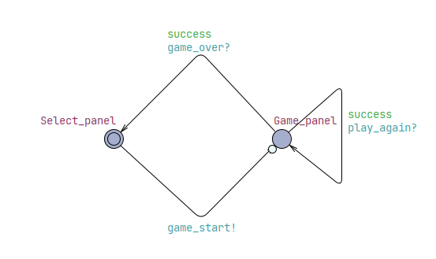
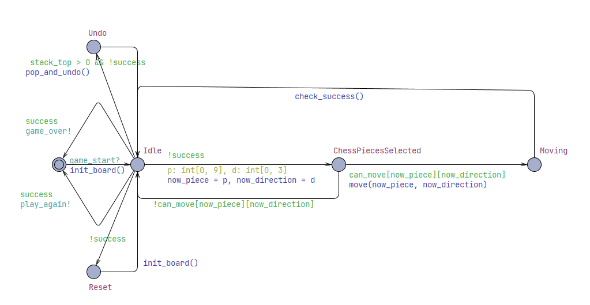
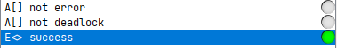

current_level could be None -> deal with it
open frontend for a lot time while backend remains open -> initial it
reset on random -> random a new one

## Model checking
The modeled system represents a simplified HuaRongDao puzzle game, implemented in UPPAAL. The puzzle consists of 5x4 grid with 10 distinct pieces of varying sizes (2x2, 2x1, 1x2, 1x1). Each piece's position is modeled by its top-left coordinate and the board layout is stored as a flattened array. Piece movement is modeled as atomic discrete transitions of moving one step in one of four directions.
The following abstractions and simplifications were made to facilitate verification:
- The choose of pieces and their directions to move in UPPAAL is abstracted into randomly choosing a number from 0 to 9(for pieces) and number from 0 to 3(for directions).
- User interface elements (piece selection, button presses) are abstracted into template states and transitions.
- The initial level selection and random level generation have been simplified to a single level initialization.
- The undo operation is simplified to restore limited steps, which is 30 in model.
- Pieces error like spliting and missing is abstracted into an error flag.
The UPPAAL model is composed of 2 parts, GameOperation and MainPanel.

### MainPanel

### GameOperation

As shown above, nearly all user interactions are covered:
- User can select a puzzle level. (Select_panel to Game_panel with sending game_start signal)
- After baord is initialized, user can select a piece and choose a direction to move. (Idle to ChessPiecesSelected means randomly select a piece and direction, then ChessPiecesSelected to Moving or back to Idle means check whether the selected piece can move in selected direction, if yes then move and otherwise choose another group of piece and direction)
- System need to check whether user match the condition of win. (Moving to Idle, if win function check_success() will change the state of success)
- During playing, user can undo his operations. (Idle to Idle with pop_and_undo() update, if user hasn't succeeded and has operated, it will undo that operation. Max for 30 times of undo in uppaal.)
- During playing, user can reset the game board. (Idle to Idle with init_board() update, if user hasn't succeeded and wants to reset his board, the board will be initialized again.)
- After winning the game, user can go back to the select panel to choose another puzzle level or just restart. (Two choices respectively corrsepond to two path from Idle to init state. One sends game_over signal and model MainPanel will receive it and move to Select_panel; the other sends play_again signal and model MainPanel will receive it and re-initialize the game board.)

This environment model covers a wide range of realistic user behaviors during puzzle play, ensuring that verification results generalize well to the actual system.

### Verification queries

We have three verification queries, A[] not error and A[] not deadlock and E<> success.
- For A[] not error, error is a flag maintained during playing. It detects whether all pieces are in the board and whether all pieces are complete, not being splited. A[] not error means in the whole process of playing, events that piece(s) is(are) missing or splited won't happen. Since this validation is for all states and these state transitions are not manifested in explicit loops, this validation cannot be concluded.
- For A[] not deadlock, it's obvious. This query ensures that the system is able to progress and no transition can block the system from proceeding. For the same reason, this validation cannot be concluded.
- For E<> success, it means for this single level board, user can find a path for caocao to escape. We need to ensure that the board we gave to users should be solvable. This validation can be concluded, but in long time, for about 500s.
