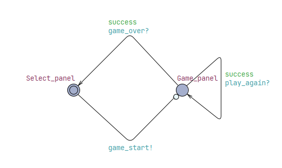
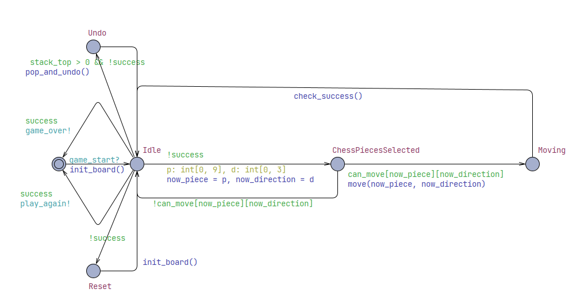
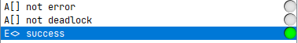

Huarongdao
Validation
Group 8

Notice:

Each class is validated by a certain python script, which is labeled brackets behind the name of the class. And each test cases in the test code is demonstrated by it's function's name in test scripts, so that you can find them using ctrl+f within our test scripts.

[toc]

# 1. Unittest

To run Unittest_backend.py, it's recommended to put it in the same directory of backend.py; for Unittest_frontend.py, it's recommended to put it in the directory of frontend.py, and one should start up backend.py in advance.

Also, for every test case, we only list the "key coverage item" that are newly tested, not covered in former test cases. For example, if TestCase1 covers TC1, TC3, and TestCase2 covers TC1, TC3, TC5, then the "key coverage item" of TestCase2 is TC5, demonstrating its unique test usage. This is because TC1 and TC3 is covered in TestCase1. There's no need for them showing up again.

Here the "TCs" in codes are in the format of "TCXX/XX+1", which means "TCXX" represent the "if" to be true, while "TCXX+1" represents the "if" to be false, and so on.

## 1.1 HuarongDaoGame(Unittest_backend.py)

### 1.1.1 set_board


| Test case          | test_set_board_invalid_length | test_set_board_invalid_piece | test_set_board_valid |
| :----------------- | ----------------------------- | ---------------------------- | -------------------- |
| key coverage items | TC1                           | TC2, TC3                     | TC4, TC5, TC6        |
| result             | passed                        | passed                       | passed               |

Test coverage = $\frac66=100\%$

### 1.1.2 move_piece


| Test case         | test_move_piece_invalid_inputs | test_move_piece_invalid_direction         | test_move_piece_all_direction_blocked                 | test_move_piece_valid  |
| ----------------- | ------------------------------ | ----------------------------------------- | ----------------------------------------------------- | ---------------------- |
| key coverage item | TC1, TC3                       | TC2, TC4, TC5, TC6, TC8, TC10, TC12, TC14 | TC7, TC9, TC11, TC13, TC17-24, TC25, TC27, TC29, TC31 | TC26, TC28, TC30, TC32 |
| result            | passed                         | passed                                    | passed                                                | passed                 |

Test coverage = $\frac{32}{32}=100\%$

### 1.1.3 undo


| Test case         | test_undo_empty | test_undo |
| ----------------- | --------------- | --------- |
| key coverage item | TC2             | TC1       |
| result            | passed          | passed    |

Test coverage = $\frac{2}{2}=100\%$

### 1.1.4 get_state


| Test case         | test_get_state_init | test_get_state |
| ----------------- | ------------------- | -------------- |
| key coverage item | TC2                 | TC1            |
| result            | passed              | passed         |

Test coverage = $\frac{2}{2}=100\%$

### 1.1.5 generate_random_board


| Test case         | test_generate_random_board_invalid | test_successful_random |
| ----------------- | ---------------------------------- | ---------------------- |
| key coverage item | TC1, TC4, TC5                      | TC2, TC3, TC6          |
| result            | passed                             | passed                 |

Test coverage = $\frac{6}{6}=100\%$

## 1.2 TestZmqFrontendServer(Unittest_backend.py)

### 1.2.1 _send_state


| Test case         | test_send_state_with_record | test_send_state_with_none_current |
| ----------------- | --------------------------- | --------------------------------- |
| key coverage item | TC1, TC4                    | TC2, TC3                          |
| result            | passed                      | passed                            |

Test coverage = $\frac{4}{4}=100\%$

### 1.2.2 handle_message

```python
def handle_message(self, msg: str = ""):
    # print(msg)
    if msg == "use_api": #TC1/2
        self.use_api = True
        self.socket.send_string("api_confirm")
    elif msg == "abandon_api": #TC3/4
        self.use_api = False
        self.socket.send_string("api_abandon")
    elif msg == "get_levels": #TC5/6
        self.game.__init__()
        levels = ",".join(self.game.levels.keys())
        self.socket.send_string(f"LEVELS@{levels}")
    elif msg.startswith("select_level@"): #TC7/8
        lvl = msg.split("@", 1)[1]
        board_str = self.game.levels.get(lvl, "")
        ok, info = self.game.set_board(board_str)
        self._send_state(info)
    elif msg == "random_level": #TC9/10
        for _ in range(1000):
            candidate = self.game.generate_random_board()
            if candidate: #TC11/12
                ok, info = self.game.set_board(candidate)
                if self.game.is_solved(): #TC13/14
                    continue
                self._send_state(info)
                break
        else :
            self.socket.send_string("MSG@Failed to generate random level")
    elif msg.startswith("move@"): #TC15/16
        body = msg.split("@", 1)[1]
        piece, direction = body.split("#", 1)
        if piece in API_DICT.keys(): #TC17/18
            self.use_api = True
            piece = API_DICT[piece]
        self.game.history.append(self.game.board.copy())
        ok, info = self.game.move_piece(piece, direction)
        if ok: #TC19/20
            self.game.steps += 1
        else:
            self.game.history.pop()
        if self.use_api: #TC21/22
            self._send_api(info)
            return
        # 如果刚刚解出
        if ok and self.game.is_solved(): #TC23/24
            elapsed = int(time.time() - self.game.start_time)
            record = self.game.high_scores[self.game.current_level]
            better = record['steps'] is None or self.game.steps < record['steps'] or (
                self.game.steps == record['steps'] and elapsed < record['time']
            )
            if better: #TC25/26
                self.game.high_scores[self.game.current_level] = {'steps': self.game.steps, 'time': elapsed}
            self.socket.send_multipart([
                f"DONE".encode()
            ])
        else:
            self._send_state(info)
    elif msg == "undo": #TC27/28
        ok, info = self.game.undo()
        if self.use_api: #TC29/30
            self._send_api(info)
        else:
            self._send_state(info)
    elif msg.startswith("set@"): #TC31/32
        board_str = msg.split("@", 1)[1]
        ok, info = self.game.set_board(board_str)
        self._send_api(info)
    elif msg == 'hint': #TC33/34
        try: #TC51/52
            with open("Development/main/Check_tool_template.xml", "r", encoding="utf-8") as f:
                xml = f.read()
            board_str = self.game.get_board_str()
            if board_str == "#" * 20: #TC35/36
                self.socket.send_string("MSG@Hint generation failed")
                return
            # print(board_str)
            board_lines = ["for (i : int[0, ROWS * COLS - 1]) board[i] = -1;\n\n  // Set board contents from string \"" + board_str + "\""]
            for i, ch in enumerate(board_str):
                if ch == '#': #TC37/38
                    board_lines.append(f"  board[{i}] = -1;")
                else:
                    board_lines.append(f"  board[{i}] = {ch};")
            board_lines.append("\n  // Assign positions")
            used = set()
            for idx, ch in enumerate(board_str):
                if ch not in used and ch != '#': #TC39/40
                    board_lines.append(f"  positions[{int(ch)}] = {idx};  // Piece {ch}")
                    used.add(ch)
            board_lines.append("  main_check();")
            init_code = '\n'.join(board_lines)
            xml = xml.replace("CODE_TEMPLATE", init_code)
            with open("Development/main/Check_tool.xml", "w", encoding="utf-8") as f:
                f.write(xml)

            cmd = ["verifyta", "-t1", "-f", "solution", "Check_tool.xml", "Check_tool.q"]
            try: #TC41/42
                # 增加 timeout 参数（这里设为 3 秒，根据需要调整）
                subprocess.run(cmd, cwd="Development/main", check=True, timeout=3)
            except subprocess.TimeoutExpired:
                # 超时直接发失败消息并跳过后续处理
                self.socket.send_string("MSG@Hint generation failed")
                return
            with open("Development/main/solution-1", "r", encoding="utf-8") as f:
                lines = f.readlines()
            start_idx = end_idx = None
            for i in range(len(lines)-1, -1, -1):
                if ';' in lines[i]: #TC43/44
                    if end_idx is None: #TC45/46
                        end_idx = i
                    elif start_idx is None: #TC47/48
                        start_idx = i
                        break
            if start_idx is not None and end_idx is not None and start_idx < end_idx: #TC49/50
                hint_block = ''.join(lines[start_idx+1:end_idx])
                parts = hint_block.split('.')
                next_movement = parts[3].split(' ')[3]
                # print(next_movement)
                self.socket.send_string(f"HINT@{next_movement}")
                os.remove("Development/main/solution-1")
                return
            self.socket.send_string("MSG@Hint generation failed")
        except Exception as e:
            self.socket.send_string(f"MSG@Hint generation failed: {e}")
    elif msg == 'get_state': #TC53/54
        self._send_state()
    else:
        self.socket.send_string("MSG@Unknown command")
```

p.s. The function code is far too long, we paste it here. Notice that we treat try/except as branch as well.

| Test case         | test_use_api | test_abandon_api | test_get_levels |
| ----------------- | ------------ | ---------------- | --------------- |
| key coverage item | TC1          | TC2, TC3         | TC4, TC5        |
| result            | passed       | passed           | passed          |

Here, test_use_api covers all the elif false branch, so we don't have to list them again.

(cont.)

| test_select | test_random_solved   | test_random_failure | test_random_success |
| ----------- | -------------------- | ------------------- | ------------------- |
| TC6, TC7    | TC8, TC9, TC11, TC13 | TC12                | TC14                |
| passed      | passed               | passed              | passed              |

(cont.)

| test_api_move                | test_normal_move       | test_UI_move_and_solve |
| ---------------------------- | ---------------------- | ---------------------- |
| TC10, TC15, TC17, TC20, TC21 | TC18, TC19, TC22, TC24 | TC23, TC25, TC26       |
| passed                       | passed                 | passed                 |

(cont.)

| test_api_undo    | test_undo | test_set   |
| ---------------- | --------- | ---------- |
| TC16, TC27, TC29 | TC30      | TC28, TC31 |
| passed           | passed    | passed     |

(cont.)

| test_hint_valid                                         | test_hint_overtime | test_hint_empty | test_hint_fail |
| ------------------------------------------------------- | ------------------ | --------------- | -------------- |
| TC32, TC33, TC51, TC37, TC38, TC39, TC40, TC41, TC43-49 | TC36, TC42         | TC35            | TC52           |
| passed                                                  | passed             | passed          | passed         |

Here, according to our UPPAAL implement and `verifyta` output format, TC50 cannot be reached and tested, since the format of the output can always be handled by the code under almost all the cases, except someone replaced our UPPAAL file.

(cont.)

| test_get_state_server | test_exception |
| --------------------- | -------------- |
| TC34, TC53            | TC54           |
| passed                | passed         |

Test coverage = $\frac{53}{54}\approx98\%$

## 1.3 BoardWidget(Unittest_frontend.py)

### 1.3.1 get_piece_span


| Test case         | test_get_piece_span |
| ----------------- | ------------------- |
| key coverage item | TC1-6               |
| result            | passed              |

Test coverage = $\frac{6}{6}=100\%$

### 1.3.2 paintEvent

```python
def paintEvent(self, event):
    painter = QPainter(self)
    area = self.rect()
    target_ratio = 4 / 5
    if area.width() / area.height() > target_ratio: #TC1/2
        h = area.height()
        w = int(h * target_ratio)
    else:
        w = area.width()
        h = int(w / target_ratio)
    board_x = area.x() + (area.width() - w) // 2
    board_y = area.y() + (area.height() - h) // 2
    board_rect = QRect(board_x, board_y, w, h)

    cell_w = board_rect.width() / 4
    cell_h = board_rect.height() / 5

    self.rect_map.clear()
    drawn = set()
    for idx, pid in enumerate(self.board):
        if pid == '#' or pid in drawn: #TC3/4
            continue
        drawn.add(pid)

        span_w, span_h = self.get_piece_span(pid)
        r, c = divmod(idx, 4)
        x = board_rect.x() + c * cell_w
        y = board_rect.y() + r * cell_h
        rect = QRect(int(x), int(y), int(span_w * cell_w), int(span_h * cell_h))
        self.rect_map[pid] = rect

        key = pid if pid in {'0','1','2','3','4','5'} else '6'
        pix = self.piece_pixmaps.get(key)
        if pix and not pix.isNull(): #TC5/6
            scaled = pix.scaled(rect.size(), Qt.KeepAspectRatio, Qt.SmoothTransformation)
            dx = (rect.width() - scaled.width()) // 2
            dy = (rect.height() - scaled.height()) // 2
            target = QRect(rect.x() + dx, rect.y() + dy, scaled.width(), scaled.height())
            painter.drawPixmap(target, scaled)
        else:
            painter.setPen(QPen(Qt.black, 2))
            painter.setBrush(self.piece_colors.get(pid, QColor(200,200,200)))
            painter.drawRect(rect)

        if pid == self.selected_id: #TC7/8
            color = QColor(255, 255, 0, 60)
            painter.fillRect(rect, color)
            inner = rect.adjusted(2, 2, -2, -2)
            painter.drawRect(inner)
        else:
            painter.setPen(QPen(Qt.black, 2))
            painter.setBrush(Qt.NoBrush)
            painter.drawRect(rect)
    # 绘制提示箭头（如有）
    if self.hint_info: #TC9/10
        pid, direction = self.hint_info
        if pid in self.rect_map: #TC11/12
            rect = self.rect_map[pid]
            painter.setPen(QPen(Qt.white, 4))
            painter.setBrush(Qt.white)
            center = rect.center()
            arrow_size = min(rect.width(), rect.height()) // 4

            if direction == 0:  # ↑ #TC13/14
                points = [
                    QPoint(center.x(), center.y() - arrow_size),
                    QPoint(center.x() - arrow_size, center.y() + arrow_size),
                    QPoint(center.x() + arrow_size, center.y() + arrow_size)
                ]
            elif direction == 1:  # ↓ #TC15/16
                points = [
                    QPoint(center.x(), center.y() + arrow_size),
                    QPoint(center.x() - arrow_size, center.y() - arrow_size),
                    QPoint(center.x() + arrow_size, center.y() - arrow_size)
                ]
            elif direction == 2:  # ← #TC17/18
                points = [
                    QPoint(center.x() - arrow_size, center.y()),
                    QPoint(center.x() + arrow_size, center.y() - arrow_size),
                    QPoint(center.x() + arrow_size, center.y() + arrow_size)
                ]
            elif direction == 3:  # → #TC19/20
                points = [
                    QPoint(center.x() + arrow_size, center.y()),
                    QPoint(center.x() - arrow_size, center.y() - arrow_size),
                    QPoint(center.x() - arrow_size, center.y() + arrow_size)
                ]
            painter.drawPolygon(*points)
    notch_w = cell_w * 2
    notch_start_x = int(board_rect.x() + (board_rect.width() - notch_w) / 2)
    notch_end_x   = int(notch_start_x + notch_w)
    y0 = board_rect.y() + board_rect.height()

    # print(notch_start_x, notch_end_x)

    # 构造多段折线，绕一圈但在底边跳过缺口
    points = [
        # 从左上角开始，顺时针
        QPoint(board_rect.x(), board_rect.y()),
        QPoint(board_rect.x() + board_rect.width(), board_rect.y()),
        QPoint(board_rect.x() + board_rect.width(), y0),
        # 底边右半段：从右下角到缺口右端
        QPoint(notch_end_x, y0),
        QPoint(notch_end_x, y0 + 5),
        # 跳过缺口，接着从缺口左端到左下角
        QPoint(notch_start_x, y0 + 5),
        QPoint(notch_start_x, y0),
        QPoint(board_rect.x(), y0),
        # 回到起点
        QPoint(board_rect.x(), board_rect.y())
    ]

    painter.setPen(QPen(Qt.red, 10))
    painter.setBrush(Qt.NoBrush)
    painter.drawPolyline(*points)
    painter.end()
```

| Test case         | test_paintEvent_wide          | test_paintEvent_tall | test_paintEvent_with_valid_pixmap     | test_paintEvent_with_null_pixmap |
| ----------------- | ----------------------------- | -------------------- | ------------------------------------- | -------------------------------- |
| key coverage item | TC1, TC3, TC4, TC5, TC8, TC10 | TC2                  | (All covered in test_paintEvent_wide) | TC6                              |
| result            | passed                        | passed               | passed                                | passed                           |

(cont.)

| test_selected_highlight | test_show_and_clear_hint |
| ----------------------- | ------------------------ |
| TC7                     | TC11, TC13-20            |
| passed                  | passed                   |

Given that hint info only comes out from piece that exists in the board, TC12 cannot be reached

Test coverage = $\frac{19}{20}=95\%$

### 1.3.3 mousePressEvent


| Test case         | test_mousePressEvent_clicked_inside_piece | test_mousePressEvent_clicked_outside_any_piece |
| ----------------- | ----------------------------------------- | ---------------------------------------------- |
| key coverage item | TC1                                       | TC2                                            |
| result            | passed                                    | passed                                         |

Test coverage = $\frac{2}{2}=100\%$

## 1.4 GameWindow(Unittest_frontend.py)

### 1.4.1 _on_level_selected


| Test case         | test_on_level_selected_with_name | test_on_level_selected_random |
| ----------------- | -------------------------------- | ----------------------------- |
| key coverage item | TC1                              | TC2                           |
| result            | passed                           | passed                        |

Test coverage = $\frac{2}{2}=100\%$

### 1.4.2 reset_game


| Test case         | test_reset_game_with_empty_game | test_reset_game_with_named_level | test_reset_game_with_random |
| ----------------- | ------------------------------- | -------------------------------- | --------------------------- |
| key coverage item | TC2, TC4                        | TC1                              | TC3                         |
| result            | passed                          | passed                           | passed                      |

Test coverage = $\frac{4}{4}=100\%$

### 1.4.3 on_response

```python
def on_response(self, msg):
    # 合并状态：STATE@<board>@<steps>@<time>@<info>
    if msg.startswith("STATE@"): #TC1/2
        # 最多分 5 段：["STATE", board, steps, time, info, best_steps, best_time]
        _, board_str, steps_str, time_str, info, best_steps, best_time = msg.split("@", 6)

        # 更新棋盘
        board = list(board_str)
        self.board_widget.board = board
        self.board_widget.update()

        # 更新步数
        self.steps = int(steps_str)
        self.step_label.setText(f"Steps: {self.steps}")

        # 更新计时
        self.elapsed = int(time_str)
        self.timer_label.setText(f"Time: {self.elapsed}s")

        if best_steps != "None" and best_time != "None": #TC3/4
            self.record_label.setText(f"Best: {best_time} s / {best_steps} steps")
        else :
            self.record_label.setText("Best: ∞ s / ∞ steps")

        # 更新提示信息
        if info: #TC5/6
            self.info_label.setText(info)
        return

    # LEVELS@l1,l2,...
    if msg.startswith("LEVELS@"): #TC7/8
        self.levels_list = msg.split("@",1)[1].split(",")
        return

    # HINT@<dir><pid>
    if msg.startswith("HINT@"): #TC9/10
        code = int(msg.split("@", 1)[1])
        pid = code % 10
        dir_code = code // 10
        self.board_widget.show_hint(str(pid), dir_code)
        return

    # 单独的普通消息
    if msg.startswith("MSG@"): #TC11/12
        text = msg.split("@", 1)[1]
        self.info_label.setText(text)
        return

    # DONE
    if msg == "DONE": #TC13/14
        msg_box = QMessageBox(self)
        msg_box.setWindowTitle("Victory!")
        msg_box.setText("Congratulations, CaoCao has successfully escaped! Would you like to play again?")
        msg_box.setStandardButtons(QMessageBox.Yes)
        msg_box.open()
        time.sleep(0.05)
        self.reset_game()
        self.show_level_menu()
        return
```

| Test case         | test_on_response_LEVELS   | test_on_response_MSG | test_on_response_HINT |
| ----------------- | ------------------------- | -------------------- | --------------------- |
| key coverage item | TC2, TC5, TC8, TC10, TC12 | TC6, TC9             | TC7                   |
| result            | passed                    | passed               | passed                |

(cont.)

| test_on_response_STATE | test_on_response_STATE_without_record | test_on_response_DONE |
| ---------------------- | ------------------------------------- | --------------------- |
| TC1, TC3               | TC4                                   | TC11                  |
| passed                 | passed                                | passed                |

Test coverage = $\frac{12}{12}=100\%$

# 2. Integration Test

Given that most of our function design, including level selection and hint function, is not included in API provided officially, the only way we carry out tests at more integrated level is UItest instead of API, which means the snippets that provide API for official API is not taken into our further test consideration.

## 2.1 **Component interactions**

In practical use, the project’s component interactions primarily occur through the information exchange between the two scripts (`frontend.py` and `backend.py`).

### 2.1.1 get levels

frontend -> backend: `get_levels`

In response:

- backend->frontend: `LEVELS@{level1,level2...}`

### 2.1.2 select level

frontend -> backend: `select_level@{level_name}`

In response:

- backend->frontend: `STATE@{board}@{steps}@{elapsed}@{msg}@{best_steps}@{best_time} `

### 2.1.3 random level

frontend->backend: `random_level`

In response:

- Generation succeeds:

  backend->frontend:`STATE@{board}@{steps}@{elapsed}@{msg}@{best_steps}@{best_time}`
- Generation fails:

  backend->frontend:`MSG@Failed to generate random level`

### 2.1.4 move

frontend->backend: `move@{pid}#{dir}`

In response:

- not solved:

  backend->frontend:`STATE@{board}@{steps}@{elapsed}@{msg}@{best_steps}@{best_time}`
- solved:

  backend->frontend:`DONE`

### 2.1.5 undo

frontend->backend: `undo`

In response:

backend->frontend:`STATE@{board}@{steps}@{elapsed}@{msg}@{best_steps}@{best_time}`

### 2.1.6 hint

frontend->backend: `hint`

In response:

- Generation succeeds: backend->frontend `HINT@{dir}{pid}`
- Generation fails: backend->frontend `MSG@Hint generation failed`

## 2.2 **Equivalent Partitioning**

### 2.2.1 get levels

No input. This happens in the very beginning of the program, which cannot be tested, since it's executed before spy is initialized.

TC1

### 2.2.2 select level

Inputs are level names. All the levels existing in the backend.py can be treated as equivalent input.

It should be considered though, is that backend can take a illegal name which doesn't exist in the level list of backend. This should be a case, however, thanks to 2.2.1 get levels, frontend can only request for those levels that exist in the level list.

TC2(valid name), TC3(invalid name)

### 2.2.3 random level

No input. But it can have 2 different outputs:

1. Successfully generated random game
2. Failure

It depends on the probability of successful randomized generation.

Under our thousands of tests, we are confident to tell that it's nearly impossible for a normal, regular board to fail on generating random game.

TC4(no input, success), TC5(no input, failure)

### 2.2.4 move

Takes piece id and direction as input. In the case of HuaRongDao Game, every piece can be treated as equivalent input, and the same goes for the directions.

However, no piece selected or no direction selected can be invalid input. Thanks to the development, the `move` instruction can only be called when directions are pressed, which implies that directions are always legal. Additionally, the initial selected piece is set as "Caocao"("1"), even before level selected and initialized, which means name is always legal as well.

Also, the valid move lead to success is also a case.

Plus, if the level is not initialized, the move is also invalid, though name and direction are all legal.

TC6(valid name, valid direction, initialized, not done)

TC7(valid name, invalid direction, initialized)

TC8(invalid name, valid direction, initialized)

TC9(invalid name, invalid direction, initialized)

TC10(not initialized)

TC11(valid name, valid direction, initialized, done)

### 2.2.5 undo

No input. And due to code features, `undo` always succeeds even when no actions were made.

TC12

### 2.2.6 hint

It has no explicit input but has implicit input, which is the board state.

If the board state is not available(empty, no solution, too hard to solve, etc), it send message to frontend.

With solvable board, it returns the next step.

TC13(solvable board), TC14(not solvable board)

## 2.3 Test Cases(IntegrateTest.py)

| Test cases     | test_invalid_move | test_undo |
| -------------- | ----------------- | --------- |
| coverage items | TC10              | TC12      |
| result         | passed            | passed    |

(cont.)

| test_valid_hint | test_invalid_hint | test_move | test_valid_select | test_valid_random | test_success |
| --------------- | ----------------- | --------- | ----------------- | ----------------- | ------------ |
| TC13            | TC14              | TC6       | TC2               | TC4               | TC11         |
| passed          | passed            | passed    | passed            | passed            | passed       |

Here, some TCs are always not reachable. There're the reasons:

For TC1, it is a kind of information transfer between frontend and backend, however, it's not an option for user. And, the result lies in the list of levels in our UI, so it's always tested with our eyes in some way.

For TC3, as it was said in 2.2.2, there's no illegal name as options in our UI list, so it cannot be covered.

For TC5, as is mentioned in 2.2.3, most of the time the generation will succeed, so random failure cannot be covered, within UItest range which manipulate frontend but cannot interfere random generation of backend.

For TC7-9, it's mentioned in 2.2.4 that name and directions are always set legal in some way. If invalid move occurs, it will be prevented in other way.

test coverage = $\frac{8}{14}\approx57\%$

# 3. System Test

As is mentioned in integration test, we'll carry it out with UItest

## 3.1 Common workflow

Expected operations are listed like:

1. select level or random level (firstly executed) TC1
2. move TC2
3. hint TC3
4. reset TC4
5. undo TC5
6. change level TC6

Theoretically, almost all the combination in any order composed by operations from 2 to 6 is expected, as long as level is initialized the very first.

## 3.2 Rare workflow

1. move before initialize level TC7
2. hint before initialize level TC8
3. reset before initialize level TC9
4. undo before initialize level TC10

That is to say, it's not expected that users try to operate the game before level is initialized.

## 3.3 Test Cases(systemTest.py)

| Test case         | test_expected_opt | test_unexpected_opt |
| ----------------- | ----------------- | ------------------- |
| key coverage item | TC1-6             | TC7-10              |
| result            | passed            | passed              |

# 4. Model checking

The modeled system represents a simplified HuaRongDao puzzle game, implemented in UPPAAL. The puzzle consists of 5x4 grid with 10 distinct pieces of varying sizes (2x2, 2x1, 1x2, 1x1). Each piece's position is modeled by its top-left coordinate and the board layout is stored as a flattened array. Piece movement is modeled as atomic discrete transitions of moving one step in one of four directions.
The following abstractions and simplifications were made to facilitate verification:

- The choose of pieces and their directions to move in UPPAAL is abstracted into randomly choosing a number from 0 to 9(for pieces) and number from 0 to 3(for directions).
- User interface elements (piece selection, button presses) are abstracted into template states and transitions.
- The initial level selection and random level generation have been simplified to a single level initialization.
- The undo operation is simplified to restore limited steps, which is 30 in model.
- Pieces error like spliting and missing is abstracted into an error flag.
  The UPPAAL model is composed of 2 parts, GameOperation and MainPanel.

## 4.1 MainPanel



## 4.2 GameOperation



As shown above, nearly all user interactions are covered:

- User can select a puzzle level. (Select_panel to Game_panel with sending game_start signal)
- After baord is initialized, user can select a piece and choose a direction to move. (Idle to ChessPiecesSelected means randomly select a piece and direction, then ChessPiecesSelected to Moving or back to Idle means check whether the selected piece can move in selected direction, if yes then move and otherwise choose another group of piece and direction)
- System need to check whether user match the condition of win. (Moving to Idle, if win function check_success() will change the state of success)
- During playing, user can undo his operations. (Idle to Idle with pop_and_undo() update, if user hasn't succeeded and has operated, it will undo that operation. Max for 30 times of undo in uppaal.)
- During playing, user can reset the game board. (Idle to Idle with init_board() update, if user hasn't succeeded and wants to reset his board, the board will be initialized again.)
- After winning the game, user can go back to the select panel to choose another puzzle level or just restart. (Two choices respectively corrsepond to two path from Idle to init state. One sends game_over signal and model MainPanel will receive it and move to Select_panel; the other sends play_again signal and model MainPanel will receive it and re-initialize the game board.)

This environment model covers a wide range of realistic user behaviors during puzzle play, ensuring that verification results generalize well to the actual system.

## 4.3 Verification queries


We have three verification queries, A[] not error and A[] not deadlock and E<> success.

- For A[] not error, error is a flag maintained during playing. It detects whether all pieces are in the board and whether all pieces are complete, not being splited. A[] not error means in the whole process of playing, events that piece(s) is(are) missing or splited won't happen. Since this validation is for all states and these state transitions are not manifested in explicit loops, this validation cannot be concluded.
- For A[] not deadlock, it's obvious. This query ensures that the system is able to progress and no transition can block the system from proceeding. For the same reason, this validation cannot be concluded.
- For E<> success, it means for this single level board, user can find a path for caocao to escape. We need to ensure that the board we gave to users should be solvable. This validation can be concluded, but in long time, for about 500s.

# 5. Risk Management

## 5.1 Risks

1. Illegal board state. (e.g. some pieces are missed, some pieces are broken into smaller pieces, etc. )

   This can happen regularly if uncarefully programed and users happen to fall into that corner case. And it may lead to important game failure.
2. Deadlock

   This would be less regular but severe, if uncarefully programed.
3. Operations before level initialized

   This can happen at a high frequency, for users can always decide to do so.

   If the operations do affect the board state or level state, it could lead to data failure. For example, undo stack could not be empty when a level just gets started.
4. Continuous movement after success

   This can happen if success is reached while user can still operate freely.

   If not taken care of, this risk can happen very frequently if users want to do so.

   And this may lead to data failure as well.
5. Current level record

   Under our structure, the game records the user's high scores of each level independently. The developer built a dictionary to achieve that. However, for random levels, it doesn't exist in our backend level lists, and the dictionary does not hold the record of it. As a result, the current level would be recognized as `None`, which could lead to runtime error. Additionally, `reset` that requires the information of current level would run into similar situation.

   If not taken care of, this could happen every time when random levels are called. And the whole program can fail.
6. UPPAAL files used for generate hint can lost or fail

   According to our development, we deployed a lightweight version of UPPAAL .xml and .q file to find the next recommended movement, making use of `subprocess` and `verifyta`. However, if these files miss, or some exceptions occur, the subprocess will fail and the frontend won't get any valid information about the hint.

   This can happens frequently, to name but a few:

   - The game is not solvable.
   - The game is hard to solve, taking UPPAAL minutes to find solution.
   - The UPPAAL files(.xml or .q) lost

   Each of them can lead to totally failure on hint generation.
7. UPPAAL chess images can lost

   We applied images for painting our chess. However, this files can lost.

   It can happen when the path of execution is inappropriate, or the image files are lost.

   If not taken care of, this would lead to UI failure. UI cannot paint chess in that case.

## 5.2 **Risk mitigation**

1. Illegal board state

   This is tested in 4.3.1 query about `error`

   It's proven that this risk doesn't exist under our structure.
2. Deadlock

   This is tested in 4.3.1 query concerning `deadlock`

   It's proven that this risk doesn't exist under our structure.
3. Operations before level initialized

   *mitigation*: we carefully designed the logic before level initialized. Any operation except level selection happens at that time will not have any affect on the state of backend.

   It's tested by 3.3 system test, test case of `test_unexpected_opt`
4. Continuous movement after success

   *mitigation*: we force the game to immediately reset after success, so that any actions happens then would be acceptable.

   It's tested by 2.3 integration test, test case of `test_success`
5. Current level record

   *mitigation*: In backend, we add logic to handle `None`  query in the high score dictionary. And we specially treat random_level in frontend. If level is not initialized, the current_level of frontend will be `None` and it will skip the reset logic; If level is normal levels in the level list, the reset function goes well; if level is random level, frontend would treat reset as another `random_level` request and ask backend for a new random level.

   This is tested by 2.3 integration test, test case of `test_valid_random_reset`(not listed in document but is a part for integration test), and 3.3 system test, test case of `test_unexpected_opt`
6. UPPAAL files used for generate hint can lost or fail

   mitigation: We add logic to check all the possible failure in backend. Nearly all the possible error cases are handled in this snippet.

   This is tested by 1.2 unit test of backend, test cases of `test_hint_valid`, `test_hint_overtime`,  `test_hint_empty`, `test_hint_fail`
7. UPPAAL chess images can lost

   *mitigation*: We added logic in painting function. If the pixel map (image files) are not successfully read in, the game would paint block rectangle with different colors.

   This is checked in unit test of frontend 1.3.2, test cases of `test_paintEvent_with_null_pixmap`
